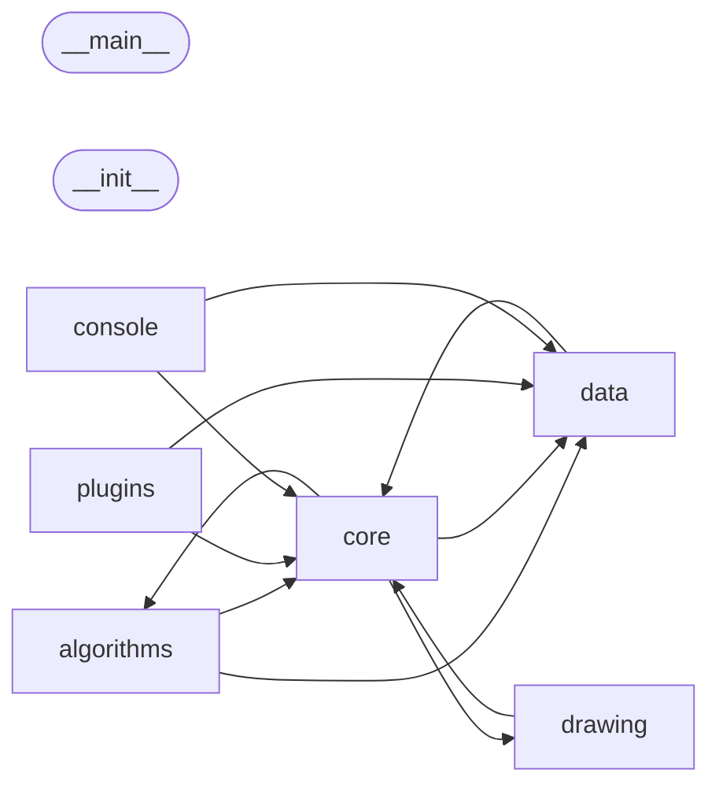

# Code Overview

[_Documentation generated by Documatic_](https://www.documatic.com)

<!---Documatic-section-Codebase Structure Python-start--->
## Codebase Structure Python

The codebase has a 4-deep folder structure,
                with 99 code files in total.

<!---Documatic-block-system_architecture-start--->

<!---Documatic-block-system_architecture-end--->

# #
<!---Documatic-section-Codebase Structure Python-end--->

<!---Documatic-section-Key Infrastructure-start--->
## Key Infrastructure

### MongoDB is used in:

* `__getattr__` of `traffic.data.eurocontrol.b2b.flight.FlightInfo`
* `flight_id` of `traffic.data.eurocontrol.b2b.flight.FlightInfo`
* `associatedRouteOrTerminalProcedure` of `traffic.data.eurocontrol.b2b.flight.ParseFields`
* `flightLevel` of `traffic.data.eurocontrol.b2b.flight.ParseFields`
* `point` of `traffic.data.eurocontrol.b2b.flight.ParseFields`
* `__getattr__` of `traffic.data.eurocontrol.b2b.flow.RegulationInfo`
* `fl_max` of `traffic.data.eurocontrol.b2b.flow.RegulationInfo`
* `fl_min` of `traffic.data.eurocontrol.b2b.flow.RegulationInfo`
* `location` of `traffic.data.eurocontrol.b2b.flow.RegulationInfo`
* `regulation_id` of `traffic.data.eurocontrol.b2b.flow.RegulationInfo`
* `start` of `traffic.data.eurocontrol.b2b.flow.RegulationInfo`
* `state` of `traffic.data.eurocontrol.b2b.flow.RegulationInfo`
* `stop` of `traffic.data.eurocontrol.b2b.flow.RegulationInfo`
* `tvId` of `traffic.data.eurocontrol.b2b.flow.RegulationInfo`
* `type` of `traffic.data.eurocontrol.b2b.flow.RegulationInfo`

# #
<!---Documatic-section-Key Infrastructure-end--->

<!---Documatic-section-Important Functions-start--->
## Important Functions

<!---Documatic-block-important_funcs-start--->
<!---Documatic-block-most_used_funcs-start--->
### Most Utilised Functions

* [traffic.data.samples.__init__.get_flight](5-traffic_data.md#traffic.data.samples.__init__.get_flight) (12 times)
* traffic.core.time.timelike (10 times)
* [traffic.core.time.to_datetime](4-traffic_core.md#traffic.core.time.to_datetime) (9 times)
* [traffic.core.geodesy.destination](4-traffic_core.md#traffic.core.geodesy.destination) (3 times)
* traffic.core.time.time_or_delta (3 times)
* [traffic.core.iterator.flight_iterator](4-traffic_core.md#traffic.core.iterator.flight_iterator) (2 times)
* traffic.core.time.deltalike (2 times)
* [traffic.core.time.to_timedelta](4-traffic_core.md#traffic.core.time.to_timedelta) (2 times)
* [traffic.core.distance.guess_airport](4-traffic_core.md#traffic.core.distance.guess_airport) (2 times)
* [traffic.core.lazy.lazy_evaluation](4-traffic_core.md#traffic.core.lazy.lazy_evaluation) (2 times)
* [traffic.core.time.round_time](4-traffic_core.md#traffic.core.time.round_time) (2 times)
* [traffic.console.__init__.dispatch_open](7-traffic_console.md#traffic.console.__init__.dispatch_open) (2 times)
* [traffic.core.geodesy.distance](4-traffic_core.md#traffic.core.geodesy.distance) (1 times)
* [traffic.core.geodesy.mrr_diagonal](4-traffic_core.md#traffic.core.geodesy.mrr_diagonal) (1 times)
* [traffic.core.distance.closest_point](4-traffic_core.md#traffic.core.distance.closest_point) (1 times)
* [traffic.algorithms.douglas_peucker.douglas_peucker](3-traffic_algorithms.md#traffic.algorithms.douglas_peucker.douglas_peucker) (1 times)
* traffic.drawing.markers.aircraft (1 times)
* [traffic.drawing.markers.rotate_marker](6-traffic_drawing.md#traffic.drawing.markers.rotate_marker) (1 times)
* traffic.drawing.markers.atc_tower (1 times)
* [traffic.algorithms.clustering.centroid](3-traffic_algorithms.md#traffic.algorithms.clustering.centroid) (1 times)
* [traffic.algorithms.cpa.closest_point_of_approach](3-traffic_algorithms.md#traffic.algorithms.cpa.closest_point_of_approach) (1 times)
* [traffic.core.cache.property_cache](4-traffic_core.md#traffic.core.cache.property_cache) (1 times)
* traffic.core.flight.attrgetter_duration (1 times)
* [traffic.core.leaflet.monkey_patch](4-traffic_core.md#traffic.core.leaflet.monkey_patch) (1 times)
* traffic.data.eurocontrol.eurofirs.eurofirs (1 times)
<!---Documatic-block-most_used_funcs-end--->
<!---Documatic-block-important_funcs-end--->

# #
<!---Documatic-section-Important Functions-end--->

<!---Documatic-section-File IO-start--->
## File IO

<!---Documatic-block-file_io-start--->
The following files have file read operations

<!---Documatic-block-traffic.core-start--->

	
<code>traffic.core</code> (Click to Expand!)

* traffic.core.airspace: r
* traffic.core.cache: w
* traffic.core.mixins

<!---Documatic-block-traffic.core-end--->

<!---Documatic-block-traffic.data-start--->

	
<code>traffic.data</code> (Click to Expand!)

* traffic.data.adsb.decode: r, rb
* traffic.data.adsb.opensky_impala: r, r, r, w
* traffic.data.basic.aircraft: aircraft_db.csv
* traffic.data.basic.airports
* traffic.data.basic.airways
* traffic.data.basic.navaid: rb, rb
* traffic.data.basic.runways: apt.dat, rb, wb, wb
* traffic.data.datasets.__init__: wb
* traffic.data.eurocontrol.b2b.__init__: wb
* traffic.data.eurocontrol.b2b.xml.__init__: r
* traffic.data.eurocontrol.ddr.airspaces: r, r
* traffic.data.eurocontrol.ddr.allft
* traffic.data.eurocontrol.ddr.freeroute
* traffic.data.eurocontrol.ddr.navpoints
* traffic.data.eurocontrol.ddr.routes
* traffic.data.eurocontrol.ddr.so6
* traffic.data.eurocontrol.eurofirs: r
* traffic.data.faa.__init__: r, w

<!---Documatic-block-traffic.data-end--->

<!---Documatic-block-traffic.plugins-start--->

	
<code>traffic.plugins</code> (Click to Expand!)

* traffic.plugins.bluesky: w
* traffic.plugins.cesiumjs: w

<!---Documatic-block-traffic.plugins-end--->

The following files have file write operations

<!---Documatic-block-traffic.console-start--->

	
<code>traffic.console</code> (Click to Expand!)

* traffic.console.opensky

<!---Documatic-block-traffic.console-end--->

<!---Documatic-block-traffic.core-start--->

	
<code>traffic.core</code> (Click to Expand!)

* traffic.core.cache
* traffic.core.lazy
* traffic.core.mixins

<!---Documatic-block-traffic.core-end--->

<!---Documatic-block-traffic.data-start--->

	
<code>traffic.data</code> (Click to Expand!)

* traffic.data.adsb.decode
* traffic.data.basic.aircraft
* traffic.data.basic.airports
* traffic.data.basic.airways
* traffic.data.basic.navaid
* traffic.data.eurocontrol.aixm.airports
* traffic.data.eurocontrol.aixm.airspaces
* traffic.data.eurocontrol.aixm.navpoints

<!---Documatic-block-traffic.data-end--->

<!---Documatic-block-traffic.drawing-start--->

	
<code>traffic.drawing</code> (Click to Expand!)

* traffic.drawing.kml

<!---Documatic-block-traffic.drawing-end--->
<!---Documatic-block-file_io-end--->

# #
<!---Documatic-section-File IO-end--->

<!---Documatic-section-Class Hierarchy-start--->
## Class Hierarchy

<!---Documatic-block-DataFrameMixin-start--->

	
<code>DataFrameMixin</code> (Click to Expand!)

* traffic.core.airspace.Airspaces
* traffic.core.mixins.GeoDBMixin
* traffic.core.mixins.GeographyMixin
* traffic.data.basic.runways.RunwayAirport

<!---Documatic-block-DataFrameMixin-end--->

<!---Documatic-block-HBoxMixin-start--->

	
<code>HBoxMixin</code> (Click to Expand!)

* [traffic.core.flight.Flight](4-traffic_core.md#traffic.core.flight.Flight)
* [traffic.core.structure.Airport](4-traffic_core.md#traffic.core.structure.Airport)
* traffic.core.traffic.Traffic
* traffic.data.basic.runways.RunwayAirport

<!---Documatic-block-HBoxMixin-end--->

<!---Documatic-block-PointMixin-start--->

	
<code>PointMixin</code> (Click to Expand!)

* [traffic.core.structure.Airport](4-traffic_core.md#traffic.core.structure.Airport)
* traffic.core.structure.Navaid
* traffic.data.basic.runways.Threshold

<!---Documatic-block-PointMixin-end--->

<!---Documatic-block-ShapelyMixin-start--->

	
<code>ShapelyMixin</code> (Click to Expand!)

* [traffic.core.flight.Flight](4-traffic_core.md#traffic.core.flight.Flight)
* [traffic.core.structure.Airport](4-traffic_core.md#traffic.core.structure.Airport)
* traffic.data.basic.runways.RunwayAirport

<!---Documatic-block-ShapelyMixin-end--->

<!---Documatic-block-traffic.algorithms.generation.ScalerProtocol-start--->

	
<code>traffic.algorithms.generation.ScalerProtocol</code> (Click to Expand!)

* traffic.algorithms.clustering.ClusteringProtocol
* traffic.algorithms.clustering.TransformerProtocol
* traffic.algorithms.generation.GenerationProtocol
* traffic.algorithms.generation.ScalerProtocol
* traffic.plugins.kepler.HasData

<!---Documatic-block-traffic.algorithms.generation.ScalerProtocol-end--->

<!---Documatic-block-traffic.core.mixins.GeographyMixin-start--->

	
<code>traffic.core.mixins.GeographyMixin</code> (Click to Expand!)

* [traffic.core.flight.Flight](4-traffic_core.md#traffic.core.flight.Flight)
* traffic.core.traffic.Traffic

<!---Documatic-block-traffic.core.mixins.GeographyMixin-end--->

<!---Documatic-block-traffic.core.structure.AirportNamedTuple-start--->

	
<code>traffic.core.structure.AirportNamedTuple</code> (Click to Expand!)

* [traffic.core.structure.Airport](4-traffic_core.md#traffic.core.structure.Airport)
* traffic.core.structure.NavaidTuple
* traffic.data.basic.runways.ThresholdTuple

<!---Documatic-block-traffic.core.structure.AirportNamedTuple-end--->

<!---Documatic-block-traffic.data.basic.navaid.Navaids-start--->

	
<code>traffic.data.basic.navaid.Navaids</code> (Click to Expand!)

* traffic.data.eurocontrol.aixm.navpoints.AIXMNavaidParser
* traffic.data.faa._designated_points.FAA_Designated_Points

<!---Documatic-block-traffic.data.basic.navaid.Navaids-end--->

# #
<!---Documatic-section-Class Hierarchy-end--->

[_Documentation generated by Documatic_](https://www.documatic.com)