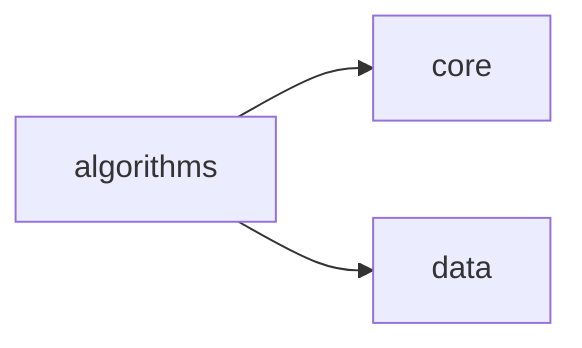
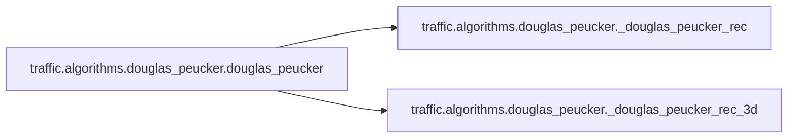

# Traffic Algorithms

[_Documentation generated by Documatic_](https://www.documatic.com)

<!---Documatic-section-Codebase Structure-start--->
## Codebase Structure

<!---Documatic-block-system_architecture-start--->

<!---Documatic-block-system_architecture-end--->

# #
<!---Documatic-section-Codebase Structure-end--->

<!---Documatic-section-traffic.algorithms.douglas_peucker.douglas_peucker-start--->
## [traffic.algorithms.douglas_peucker.douglas_peucker](3-traffic_algorithms.md#traffic.algorithms.douglas_peucker.douglas_peucker)

<!---Documatic-section-douglas_peucker-start--->


### Object Calls

* [traffic.algorithms.douglas_peucker._douglas_peucker_rec](3-traffic_algorithms.md#traffic.algorithms.douglas_peucker._douglas_peucker_rec)
* [traffic.algorithms.douglas_peucker._douglas_peucker_rec_3d](3-traffic_algorithms.md#traffic.algorithms.douglas_peucker._douglas_peucker_rec_3d)

<!---Documatic-block-traffic.algorithms.douglas_peucker.douglas_peucker-start--->
<details>
	<summary><code>traffic.algorithms.douglas_peucker.douglas_peucker</code> code snippet</summary>

```python
def douglas_peucker(*, df: pd.DataFrame=None, tolerance: float, x: Union[str, pd.Series]='x', y: Union[str, pd.Series]='y', z: Union[None, str, pd.Series]=None, z_factor: float=3.048, lat: Union[None, str, pd.Series]=None, lon: Union[None, str, pd.Series]=None) -> np.ndarray:
    if df is None and (isinstance(x, str) or isinstance(y, str)):
        raise ValueError('Provide a dataframe if x and y are column names')
    if df is None and (isinstance(lon, str) or isinstance(lat, str)):
        raise ValueError('Provide a dataframe if lat and lon are column names')
    if tolerance < 0:
        raise ValueError('tolerance must be a positive float')
    if df is not None and isinstance(lat, str) and isinstance(lon, str):
        (lat, lon) = (df[lat], df[lon])
    if isinstance(lat, str) or isinstance(lon, str):
        raise ValueError('lat and lon must now be Pandas Series')
    if df is not None and lat is not None and (lon is not None):
        projection = pyproj.Proj(proj='lcc', ellps='WGS84', lat_1=lat.min(), lat_2=lat.max(), lat_0=lat.mean(), lon_0=lon.mean())
        transformer = pyproj.Transformer.from_proj(pyproj.Proj('epsg:4326'), projection, always_xy=True)
        (x, y) = transformer.transform(lon.values, lat.values)
    else:
        if df is not None:
            (x, y) = (df[x].values, df[y].values)
        (x, y) = (np.array(x), np.array(y))
    if z is not None:
        if df is not None:
            z = df[z].values
        z = z_factor * np.array(z)
    mask = np.ones(len(x), dtype=bool)
    if z is None:
        _douglas_peucker_rec(x, y, mask, tolerance)
    else:
        _douglas_peucker_rec_3d(x, y, z, mask, tolerance)
    return mask
```
</details>
<!---Documatic-block-traffic.algorithms.douglas_peucker.douglas_peucker-end--->
<!---Documatic-section-douglas_peucker-end--->

# #
<!---Documatic-section-traffic.algorithms.douglas_peucker.douglas_peucker-end--->

<!---Documatic-section-traffic.algorithms.clustering.centroid-start--->
## [traffic.algorithms.clustering.centroid](3-traffic_algorithms.md#traffic.algorithms.clustering.centroid)

<!---Documatic-section-centroid-start--->


### Object Calls

* [traffic.algorithms.clustering.prepare_features](3-traffic_algorithms.md#traffic.algorithms.clustering.prepare_features)

<!---Documatic-block-traffic.algorithms.clustering.centroid-start--->
<details>
	<summary><code>traffic.algorithms.clustering.centroid</code> code snippet</summary>

```python
def centroid(traffic: 'Traffic', nb_samples: Optional[int], features: List[str], projection: Union[None, 'crs.Projection', pyproj.Proj]=None, transform: Optional[TransformerProtocol]=None, max_workers: int=1, *args: Any, **kwargs: Any) -> 'Flight':
    from scipy.spatial.distance import pdist, squareform
    X = prepare_features(traffic, nb_samples, features, projection, max_workers)
    ids = list((f.flight_id for f in traffic))
    if transform is not None:
        X = transform.fit_transform(X)
    index = ids[squareform(pdist(X, *args, **kwargs)).mean(axis=1).argmin()]
    assert isinstance(index, str)
    flight = traffic[index]
    assert flight is not None
    return flight
```
</details>
<!---Documatic-block-traffic.algorithms.clustering.centroid-end--->
<!---Documatic-section-centroid-end--->

# #
<!---Documatic-section-traffic.algorithms.clustering.centroid-end--->

<!---Documatic-section-traffic.algorithms.cpa.closest_point_of_approach-start--->
## [traffic.algorithms.cpa.closest_point_of_approach](3-traffic_algorithms.md#traffic.algorithms.cpa.closest_point_of_approach)

<!---Documatic-section-closest_point_of_approach-start--->


### Object Calls

* [traffic.algorithms.cpa.CPA](3-traffic_algorithms.md#traffic.algorithms.cpa.CPA)
* [traffic.algorithms.cpa.combinations](3-traffic_algorithms.md#traffic.algorithms.cpa.combinations)

<!---Documatic-block-traffic.algorithms.cpa.closest_point_of_approach-start--->
<details>
	<summary><code>traffic.algorithms.cpa.closest_point_of_approach</code> code snippet</summary>

```python
def closest_point_of_approach(traffic: 'Traffic', lateral_separation: float, vertical_separation: float, projection: Union[pyproj.Proj, 'crs.Projection', None]=None, round_t: str='d', max_workers: int=4) -> Optional[CPA]:
    from cartopy import crs
    if projection is None:
        _log.warn('Defaulting to projection EuroPP()')
        projection = crs.EuroPP()
    if isinstance(projection, crs.Projection):
        projection = pyproj.Proj(projection.proj4_init)

    def yield_pairs(t_chunk: 'Traffic') -> Iterator[Tuple[Flight, Flight]]:
        """
        This function yields all pairs of possible candidates for a CPA
        calculation.
        """
        for (first, second) in combinations(t_chunk, lateral_separation=lateral_separation, vertical_separation=vertical_separation):
            first_shape = first.project_shape(projection)
            second_shape = second.project_shape(projection)
            if first_shape is None or second_shape is None:
                continue
            if not first_shape.is_valid or not second_shape.is_valid:
                continue
            first_shape = first_shape.simplify(1000.0).buffer(lateral_separation / 2)
            second_shape = first_shape.simplify(1000.0).buffer(lateral_separation / 2)
            if first_shape.intersects(second_shape):
                yield (first, second)
    t_xyt = traffic.airborne().compute_xy(projection).assign(round_t=lambda df: df.timestamp.dt.round(round_t))
    cumul = list()
    for (_, t_chunk) in tqdm(t_xyt.groupby('round_t'), total=len(set(t_xyt.data.round_t))):
        with ProcessPoolExecutor(max_workers=max_workers) as executor:
            tasks = {executor.submit(cast(Callable[[Flight, Flight], Flight], Flight.distance), first, second): (first.icao24, second.icao24) for (first, second) in yield_pairs(traffic.__class__(t_chunk))}
            for future in as_completed(tasks):
                result = future.result()
                if result is not None:
                    cumul.append(result)
    if len(cumul) == 0:
        return None
    return CPA(pd.concat(cumul, sort=False))
```
</details>
<!---Documatic-block-traffic.algorithms.cpa.closest_point_of_approach-end--->
<!---Documatic-section-closest_point_of_approach-end--->

# #
<!---Documatic-section-traffic.algorithms.cpa.closest_point_of_approach-end--->

<!---Documatic-section-traffic.algorithms.douglas_peucker._douglas_peucker_rec_3d-start--->
## [traffic.algorithms.douglas_peucker._douglas_peucker_rec_3d](3-traffic_algorithms.md#traffic.algorithms.douglas_peucker._douglas_peucker_rec_3d)

<!---Documatic-section-_douglas_peucker_rec_3d-start--->
<!---Documatic-block-traffic.algorithms.douglas_peucker._douglas_peucker_rec_3d-start--->
<details>
	<summary><code>traffic.algorithms.douglas_peucker._douglas_peucker_rec_3d</code> code snippet</summary>

```python
def _douglas_peucker_rec_3d(x: np.ndarray, y: np.ndarray, z: np.ndarray, mask: np.ndarray, tolerance: float) -> None:
    l = len(x)
    if l < 3:
        return
    start = np.array([x[0], y[0], z[0]])
    end = np.array([x[-1], y[-1], z[-1]])
    point = np.dstack([x[1:], y[1:], z[1:]])[0] - start
    d = np.cross(point, (start - end) / np.linalg.norm(start - end))
    d = np.sqrt(np.sum(d * d, axis=1))
    if np.max(d) < tolerance:
        mask[np.s_[1:l - 1]] = 0
        return
    arg = cast(int, np.argmax(d))
    _douglas_peucker_rec_3d(x[:arg + 2], y[:arg + 2], z[:arg + 2], mask[:arg + 2], tolerance)
    _douglas_peucker_rec_3d(x[arg + 1:], y[arg + 1:], z[arg + 1:], mask[arg + 1:], tolerance)
```
</details>
<!---Documatic-block-traffic.algorithms.douglas_peucker._douglas_peucker_rec_3d-end--->
<!---Documatic-section-_douglas_peucker_rec_3d-end--->

# #
<!---Documatic-section-traffic.algorithms.douglas_peucker._douglas_peucker_rec_3d-end--->

<!---Documatic-section-traffic.algorithms.clustering.prepare_features-start--->
## [traffic.algorithms.clustering.prepare_features](3-traffic_algorithms.md#traffic.algorithms.clustering.prepare_features)

<!---Documatic-section-prepare_features-start--->
<!---Documatic-block-traffic.algorithms.clustering.prepare_features-start--->
<details>
	<summary><code>traffic.algorithms.clustering.prepare_features</code> code snippet</summary>

```python
def prepare_features(traffic: 'Traffic', nb_samples: Optional[int], features: List[str], projection: Union[None, 'crs.Projection', pyproj.Proj]=None, max_workers: int=1) -> Numeric:
    if 'last_position' in traffic.data.columns:
        traffic = traffic.drop(columns='last_position')
    resampled = traffic
    if nb_samples is not None:
        _resampled = traffic.resample(nb_samples).eval(max_workers=max_workers)
        assert _resampled is not None
        resampled = _resampled
    if all(['x' in features, 'y' in features, 'x' not in resampled.data.columns, 'y' not in resampled.data.columns]):
        if projection is None:
            raise RuntimeError("No 'x' and 'y' columns nor projection method passed")
        resampled = resampled.compute_xy(projection)
    return np.stack(list((f.data[features].values.ravel() for f in resampled)))
```
</details>
<!---Documatic-block-traffic.algorithms.clustering.prepare_features-end--->
<!---Documatic-section-prepare_features-end--->

# #
<!---Documatic-section-traffic.algorithms.clustering.prepare_features-end--->

<!---Documatic-section-traffic.algorithms.cpa.CPA-start--->
## [traffic.algorithms.cpa.CPA](3-traffic_algorithms.md#traffic.algorithms.cpa.CPA)

<!---Documatic-section-CPA-start--->
<!---Documatic-block-traffic.algorithms.cpa.CPA-start--->
<details>
	<summary><code>traffic.algorithms.cpa.CPA</code> code snippet</summary>

```python
class CPA(DataFrameMixin):

    def aggregate(self, lateral_separation: float=5, vertical_separation: float=1000) -> 'CPA':
        return self.assign(tmp_lateral=lambda df: df.lateral / lateral_separation, tmp_vertical=lambda df: df.vertical / vertical_separation).assign(aggregated=lambda df: df[['tmp_lateral', 'tmp_vertical']].max(axis=1)).drop(columns=['tmp_lateral', 'tmp_vertical'])

    def min(self, column: str) -> 'CPA':
        return self.__class__(self.sort_values(column).groupby(['icao24_x', 'icao24_y']).first())

    def _ipython_key_completions_(self) -> Set[str]:
        return self.flight_ids()

    def flight_ids(self) -> Set[str]:
        return {*set(self.data.flight_id_x), *set(self.data.flight_id_y)}

    def __getitem__(self, index: str) -> 'CPA':
        df = self.data
        rename_cols = {'latitude_x': 'latitude_y', 'latitude_y': 'latitude_x', 'longitude_x': 'longitude_y', 'longitude_y': 'longitude_x', 'altitude_x': 'altitude_y', 'altitude_y': 'altitude_x', 'icao24_x': 'icao24_y', 'icao24_y': 'icao24_x', 'callsign_x': 'callsign_y', 'callsign_y': 'callsign_x'}
        if 'flight_id_x' in self.data.columns:
            rename_cols['flight_id_x'] = 'flight_id_y'
            rename_cols['flight_id_y'] = 'flight_id_x'
            res = pd.concat([df.query('flight_id_y == @index'), df.query('flight_id_x == @index').rename(columns=rename_cols)], sort=False)
            if res.shape[0] > 0:
                return self.__class__(res)
        res = pd.concat([df.query('icao24_y == @index'), df.query('icao24_x == @index').rename(columns=rename_cols)], sort=False)
        return self.__class__(res)

    def _repr_html_(self) -> str:
        try:
            return self.data.style.background_gradient(subset=['aggregated'], cmap='bwr_r', low=0.9, high=1.0)._repr_html_()
        except Exception:
            return super()._repr_html_()
```
</details>
<!---Documatic-block-traffic.algorithms.cpa.CPA-end--->
<!---Documatic-section-CPA-end--->

# #
<!---Documatic-section-traffic.algorithms.cpa.CPA-end--->

<!---Documatic-section-traffic.algorithms.cpa.combinations-start--->
## [traffic.algorithms.cpa.combinations](3-traffic_algorithms.md#traffic.algorithms.cpa.combinations)

<!---Documatic-section-combinations-start--->
<!---Documatic-block-traffic.algorithms.cpa.combinations-start--->
<details>
	<summary><code>traffic.algorithms.cpa.combinations</code> code snippet</summary>

```python
def combinations(t: 'Traffic', lateral_separation: float, vertical_separation: float) -> Iterator[Tuple[Flight, Flight]]:
    for flight in t:
        t_ = t.query(f'icao24 != "{flight.icao24}"')
        if t_ is None:
            continue
        clipped = t_.query(f'''x >= {flight.min('x')} - {lateral_separation} and x <= {flight.max('x')} + {lateral_separation} and y >= {flight.min('y')} - {lateral_separation} and y <= {flight.max('y')} + {lateral_separation} and altitude >= {flight.min('altitude')} - {vertical_separation} and altitude <= {flight.max('altitude')} + {vertical_separation} and timestamp <= "{flight.stop}" and timestamp >= "{flight.start}" ''')
        if clipped is None:
            continue
        for second in clipped:
            yield (flight, second)
```
</details>
<!---Documatic-block-traffic.algorithms.cpa.combinations-end--->
<!---Documatic-section-combinations-end--->

# #
<!---Documatic-section-traffic.algorithms.cpa.combinations-end--->

<!---Documatic-section-traffic.algorithms.douglas_peucker._douglas_peucker_rec-start--->
## [traffic.algorithms.douglas_peucker._douglas_peucker_rec](3-traffic_algorithms.md#traffic.algorithms.douglas_peucker._douglas_peucker_rec)

<!---Documatic-section-_douglas_peucker_rec-start--->
<!---Documatic-block-traffic.algorithms.douglas_peucker._douglas_peucker_rec-start--->
<details>
	<summary><code>traffic.algorithms.douglas_peucker._douglas_peucker_rec</code> code snippet</summary>

```python
def _douglas_peucker_rec(x: np.ndarray, y: np.ndarray, mask: np.ndarray, tolerance: float) -> None:
    l = len(x)
    if l < 3:
        return
    v = np.array([[y[len(x) - 1] - y[0]], [x[0] - x[len(x) - 1]]])
    d = np.abs(np.dot(np.dstack([x[1:-1] - x[0], y[1:-1] - y[0]])[0], v / np.sqrt(np.sum(v * v))))
    if np.max(d) < tolerance:
        mask[np.s_[1:l - 1]] = 0
        return
    arg = cast(int, np.argmax(d))
    _douglas_peucker_rec(x[:arg + 2], y[:arg + 2], mask[:arg + 2], tolerance)
    _douglas_peucker_rec(x[arg + 1:], y[arg + 1:], mask[arg + 1:], tolerance)
```
</details>
<!---Documatic-block-traffic.algorithms.douglas_peucker._douglas_peucker_rec-end--->
<!---Documatic-section-_douglas_peucker_rec-end--->

# #
<!---Documatic-section-traffic.algorithms.douglas_peucker._douglas_peucker_rec-end--->

[_Documentation generated by Documatic_](https://www.documatic.com)