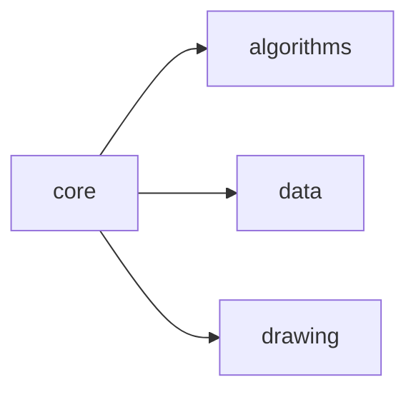
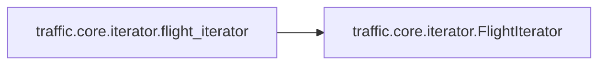
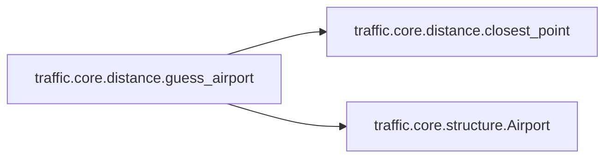
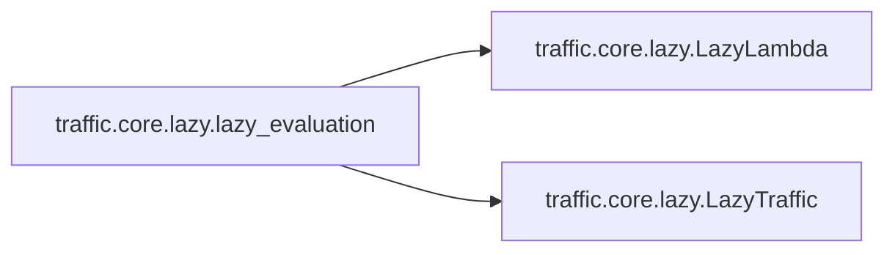

# Traffic Core

[_Documentation generated by Documatic_](https://www.documatic.com)

<!---Documatic-section-Codebase Structure-start--->
## Codebase Structure

<!---Documatic-block-system_architecture-start--->

<!---Documatic-block-system_architecture-end--->

# #
<!---Documatic-section-Codebase Structure-end--->

<!---Documatic-section-traffic.core.time.to_datetime-start--->
## [traffic.core.time.to_datetime](4-traffic_core.md#traffic.core.time.to_datetime)

<!---Documatic-section-to_datetime-start--->
<!---Documatic-block-traffic.core.time.to_datetime-start--->
<details>
	<summary><code>traffic.core.time.to_datetime</code> code snippet</summary>

```python
def to_datetime(time: timelike) -> datetime:
    if isinstance(time, str):
        time = pd.Timestamp(time, tz='utc')
    if isinstance(time, pd.Timestamp):
        time = time.to_pydatetime()
    if isinstance(time, Real):
        time = datetime.fromtimestamp(float(time), timezone.utc)
    if time.tzinfo is None:
        warnings.warn('This timestamp is tz-naive. Things may not work as expected. If you construct your timestamps manually, consider passing a string, which defaults to UTC. If you construct your timestamps automatically, look at the tzinfo (resp. tz) argument of the datetime (resp. pd.Timestamp) constructor.')
    return time
```
</details>
<!---Documatic-block-traffic.core.time.to_datetime-end--->
<!---Documatic-section-to_datetime-end--->

# #
<!---Documatic-section-traffic.core.time.to_datetime-end--->

<!---Documatic-section-traffic.core.geodesy.destination-start--->
## [traffic.core.geodesy.destination](4-traffic_core.md#traffic.core.geodesy.destination)

<!---Documatic-section-destination-start--->
<!---Documatic-block-traffic.core.geodesy.destination-start--->
<details>
	<summary><code>traffic.core.geodesy.destination</code> code snippet</summary>

```python
def destination(lat: F, lon: F, bearing: F, distance: F, *args: Any, **kwargs: Any) -> tuple[F, F, F]:
    geod = Geod(ellps='WGS84')
    (lon_, lat_, back_) = geod.fwd(lon, lat, bearing, distance, *args, **kwargs)
    return (lat_, lon_, back_)
```
</details>
<!---Documatic-block-traffic.core.geodesy.destination-end--->
<!---Documatic-section-destination-end--->

# #
<!---Documatic-section-traffic.core.geodesy.destination-end--->

<!---Documatic-section-traffic.core.iterator.flight_iterator-start--->
## [traffic.core.iterator.flight_iterator](4-traffic_core.md#traffic.core.iterator.flight_iterator)

<!---Documatic-section-flight_iterator-start--->


### Object Calls

* [traffic.core.iterator.FlightIterator](4-traffic_core.md#traffic.core.iterator.FlightIterator)

<!---Documatic-block-traffic.core.iterator.flight_iterator-start--->
<details>
	<summary><code>traffic.core.iterator.flight_iterator</code> code snippet</summary>

```python
def flight_iterator(fun: Callable[..., Iterator['Flight']]) -> Callable[..., FlightIterator]:
    msg = f"""The @flight_iterator decorator can only be set on methods  annotated with an Iterator["Flight"] return type. Got {fun.__annotations__['return']}"""
    if not (fun.__annotations__['return'] == Iterator['Flight'] or eval(fun.__annotations__['return']) == Iterator['Flight']):
        print(eval(fun.__annotations__['return']))
        print(Iterator['Flight'])
        raise TypeError(msg)

    @functools.wraps(fun, updated=('__dict__', '__annotations__'))
    def fun_wrapper(*args: Any, **kwargs: Any) -> FlightIterator:
        return FlightIterator(fun(*args, **kwargs))
    fun_wrapper = cast(Callable[..., FlightIterator], fun_wrapper)
    fun_wrapper.__annotations__['return'] = FlightIterator
    return fun_wrapper
```
</details>
<!---Documatic-block-traffic.core.iterator.flight_iterator-end--->
<!---Documatic-section-flight_iterator-end--->

# #
<!---Documatic-section-traffic.core.iterator.flight_iterator-end--->

<!---Documatic-section-traffic.core.time.to_timedelta-start--->
## [traffic.core.time.to_timedelta](4-traffic_core.md#traffic.core.time.to_timedelta)

<!---Documatic-section-to_timedelta-start--->
<!---Documatic-block-traffic.core.time.to_timedelta-start--->
<details>
	<summary><code>traffic.core.time.to_timedelta</code> code snippet</summary>

```python
def to_timedelta(delta: deltalike, **kwargs: Any) -> Union[timedelta, pd.Timedelta]:
    if isinstance(delta, Real):
        delta = timedelta(seconds=float(delta))
    if isinstance(delta, str):
        delta = pd.Timedelta(delta)
    if delta is None:
        delta = timedelta(**kwargs)
    return delta
```
</details>
<!---Documatic-block-traffic.core.time.to_timedelta-end--->
<!---Documatic-section-to_timedelta-end--->

# #
<!---Documatic-section-traffic.core.time.to_timedelta-end--->

<!---Documatic-section-traffic.core.distance.guess_airport-start--->
## [traffic.core.distance.guess_airport](4-traffic_core.md#traffic.core.distance.guess_airport)

<!---Documatic-section-guess_airport-start--->


### Object Calls

* [traffic.core.distance.closest_point](4-traffic_core.md#traffic.core.distance.closest_point)
* [traffic.core.structure.Airport](4-traffic_core.md#traffic.core.structure.Airport)

<!---Documatic-block-traffic.core.distance.guess_airport-start--->
<details>
	<summary><code>traffic.core.distance.guess_airport</code> code snippet</summary>

```python
def guess_airport(point: Optional[NamedTuple]=None, *, latitude: Optional[float]=None, longitude: Optional[float]=None, dataset: Optional['Airports']=None, warning_distance: Optional[float]=None) -> 'Airport':
    from ..core.structure import Airport
    if dataset is None:
        from ..data import airports
        dataset = airports
    if point is not None:
        longitude = point.longitude
        latitude = point.latitude
    if any((longitude is None, latitude is None)):
        raise RuntimeError('latitude or longitude are None')
    airport_data = closest_point(dataset.data, latitude=latitude, longitude=longitude)
    airport = Airport(airport_data.get('altitude'), airport_data.get('country'), airport_data.get('iata'), airport_data.get('icao'), airport_data.get('latitude'), airport_data.get('longitude'), airport_data.get('name'))
    airport.distance = airport_data.distance
    if warning_distance is not None and airport.distance > warning_distance:
        _log.warning(f'Closest airport is more than {warning_distance * 0.001}km away  (distance={airport.distance})')
    return airport
```
</details>
<!---Documatic-block-traffic.core.distance.guess_airport-end--->
<!---Documatic-section-guess_airport-end--->

# #
<!---Documatic-section-traffic.core.distance.guess_airport-end--->

<!---Documatic-section-traffic.core.lazy.lazy_evaluation-start--->
## [traffic.core.lazy.lazy_evaluation](4-traffic_core.md#traffic.core.lazy.lazy_evaluation)

<!---Documatic-section-lazy_evaluation-start--->


### Object Calls

* [traffic.core.lazy.LazyLambda](4-traffic_core.md#traffic.core.lazy.LazyLambda)
* [traffic.core.lazy.LazyTraffic](4-traffic_core.md#traffic.core.lazy.LazyTraffic)

<!---Documatic-block-traffic.core.lazy.lazy_evaluation-start--->
<details>
	<summary><code>traffic.core.lazy.lazy_evaluation</code> code snippet</summary>

```python
@overload
def lazy_evaluation(default: 'Literal[None, False]'=False, idx_name: Optional[str]=None) -> Callable[..., Callable[..., LazyTraffic]]:
    ...
```
</details>
<!---Documatic-block-traffic.core.lazy.lazy_evaluation-end--->
<!---Documatic-section-lazy_evaluation-end--->

# #
<!---Documatic-section-traffic.core.lazy.lazy_evaluation-end--->

<!---Documatic-section-traffic.core.time.round_time-start--->
## [traffic.core.time.round_time](4-traffic_core.md#traffic.core.time.round_time)

<!---Documatic-section-round_time-start--->


### Object Calls

* [traffic.core.time.to_datetime](4-traffic_core.md#traffic.core.time.to_datetime)

<!---Documatic-block-traffic.core.time.round_time-start--->
<details>
	<summary><code>traffic.core.time.round_time</code> code snippet</summary>

```python
def round_time(time: timelike, how: str='before', by: timedelta=timedelta(hours=1)) -> datetime:
    dt = to_datetime(time)
    round_to = by.total_seconds()
    if dt.tzinfo is None:
        seconds = (dt - dt.min).seconds
    else:
        seconds = (dt - dt.min.replace(tzinfo=timezone.utc)).seconds
    if how == 'after':
        rounding = (seconds + round_to) // round_to * round_to
    elif how == 'before':
        rounding = seconds // round_to * round_to
    else:
        raise ValueError('parameter how must be `before` or `after`')
    return dt + timedelta(0, rounding - seconds, -dt.microsecond)
```
</details>
<!---Documatic-block-traffic.core.time.round_time-end--->
<!---Documatic-section-round_time-end--->

# #
<!---Documatic-section-traffic.core.time.round_time-end--->

<!---Documatic-section-traffic.core.geodesy.distance-start--->
## [traffic.core.geodesy.distance](4-traffic_core.md#traffic.core.geodesy.distance)

<!---Documatic-section-distance-start--->
<!---Documatic-block-traffic.core.geodesy.distance-start--->
<details>
	<summary><code>traffic.core.geodesy.distance</code> code snippet</summary>

```python
def distance(lat1: F, lon1: F, lat2: F, lon2: F, *args: Any, **kwargs: Any) -> F:
    geod = Geod(ellps='WGS84')
    (angle1, angle2, dist1) = geod.inv(lon1, lat1, lon2, lat2, *args, **kwargs)
    return dist1
```
</details>
<!---Documatic-block-traffic.core.geodesy.distance-end--->
<!---Documatic-section-distance-end--->

# #
<!---Documatic-section-traffic.core.geodesy.distance-end--->

<!---Documatic-section-traffic.core.geodesy.mrr_diagonal-start--->
## [traffic.core.geodesy.mrr_diagonal](4-traffic_core.md#traffic.core.geodesy.mrr_diagonal)

<!---Documatic-section-mrr_diagonal-start--->


### Object Calls

* [traffic.core.geodesy.distance](4-traffic_core.md#traffic.core.geodesy.distance)

<!---Documatic-block-traffic.core.geodesy.mrr_diagonal-start--->
<details>
	<summary><code>traffic.core.geodesy.mrr_diagonal</code> code snippet</summary>

```python
def mrr_diagonal(geom: base.BaseGeometry) -> float:
    if len(geom) <= 1:
        return 0
    if len(geom) == 2:
        return distance(lat1=geom[0].y, lon1=geom[0].x, lat2=geom[1].y, lon2=geom[1].x)
    mrr = LineString(geom).minimum_rotated_rectangle
    if isinstance(mrr, Point):
        return 0
    try:
        (x, y) = mrr.exterior.coords.xy
    except AttributeError:
        (p0, p1) = (mrr.coords[0], mrr.coords[-1])
        return distance(p0[1], p0[0], p1[1], p1[0])
    return distance(y[0], x[0], y[2], x[2])
```
</details>
<!---Documatic-block-traffic.core.geodesy.mrr_diagonal-end--->
<!---Documatic-section-mrr_diagonal-end--->

# #
<!---Documatic-section-traffic.core.geodesy.mrr_diagonal-end--->

<!---Documatic-section-traffic.core.distance.closest_point-start--->
## [traffic.core.distance.closest_point](4-traffic_core.md#traffic.core.distance.closest_point)

<!---Documatic-section-closest_point-start--->
<!---Documatic-block-traffic.core.distance.closest_point-start--->
<details>
	<summary><code>traffic.core.distance.closest_point</code> code snippet</summary>

```python
def closest_point(data: pd.DataFrame, point: Optional['PointMixin']=None, *, latitude: Optional[float]=None, longitude: Optional[float]=None) -> pd.Series:
    if point is not None:
        latitude = point.latitude
        longitude = point.longitude
        name = point.name
    else:
        name = 'unnamed'
    assert latitude is not None and longitude is not None
    dist_vect = geo.distance(data.latitude.values, data.longitude.values, latitude * np.ones(len(data.latitude)), longitude * np.ones(len(data.longitude)))
    argmin = dist_vect.argmin()
    elt = data.iloc[argmin]
    return pd.Series({**dict(elt), **{'distance': dist_vect[argmin], 'point': name}}, name=elt.name)
```
</details>
<!---Documatic-block-traffic.core.distance.closest_point-end--->
<!---Documatic-section-closest_point-end--->

# #
<!---Documatic-section-traffic.core.distance.closest_point-end--->

<!---Documatic-section-traffic.core.cache.property_cache-start--->
## [traffic.core.cache.property_cache](4-traffic_core.md#traffic.core.cache.property_cache)

<!---Documatic-section-property_cache-start--->
<!---Documatic-block-traffic.core.cache.property_cache-start--->
<details>
	<summary><code>traffic.core.cache.property_cache</code> code snippet</summary>

```python
class property_cache(object):

    def __init__(self, method: Callable[..., Any]) -> None:
        self.method = method
        self.name = method.__name__
        self.__doc__ = method.__doc__
        self.__annotations__ = method.__annotations__

    def __get__(self, instance: Any, cls: Any) -> Any:
        if instance is None:
            return self
        result = self.method(instance)
        setattr(instance, self.name, result)
        return result
```
</details>
<!---Documatic-block-traffic.core.cache.property_cache-end--->
<!---Documatic-section-property_cache-end--->

# #
<!---Documatic-section-traffic.core.cache.property_cache-end--->

<!---Documatic-section-traffic.core.leaflet.monkey_patch-start--->
## [traffic.core.leaflet.monkey_patch](4-traffic_core.md#traffic.core.leaflet.monkey_patch)

<!---Documatic-section-monkey_patch-start--->
<!---Documatic-block-traffic.core.leaflet.monkey_patch-start--->
<details>
	<summary><code>traffic.core.leaflet.monkey_patch</code> code snippet</summary>

```python
def monkey_patch() -> None:
    setattr(Map, 'add_layer', map_add_layer)
```
</details>
<!---Documatic-block-traffic.core.leaflet.monkey_patch-end--->
<!---Documatic-section-monkey_patch-end--->

# #
<!---Documatic-section-traffic.core.leaflet.monkey_patch-end--->

<!---Documatic-section-traffic.core.structure.Airport-start--->
## [traffic.core.structure.Airport](4-traffic_core.md#traffic.core.structure.Airport)

<!---Documatic-section-Airport-start--->
<!---Documatic-block-traffic.core.structure.Airport-start--->
<details>
	<summary><code>traffic.core.structure.Airport</code> code snippet</summary>

```python
@rich.repr.auto()
class Airport(FormatMixin, HBoxMixin, AirportNamedTuple, PointMixin, ShapelyMixin):

    def __rich_repr__(self) -> rich.repr.Result:
        yield ('icao', self.icao)
        if self.iata:
            yield ('iata', self.iata)
        if self.name:
            yield ('name', self.name)
        if self.country:
            yield ('country', self.country)
        if self.latitude and self.longitude:
            yield ('latitude', self.latitude)
            yield ('longitude', self.longitude)
        if self.altitude:
            yield ('altitude', self.altitude)

    def _repr_html_(self) -> str:
        title = '<h4><b>Airport</b></h4>'
        if self.runways is not None and self.runways.shape.is_empty and (self.runway.data.shape[0] > 0):
            title += "<div class='alert alert-warning'><p>"
            title += '<b>Warning!</b> No runway information available in our '
            title += 'database. Please consider helping the community by '
            title += 'updating the runway information with data provided '
            title += 'by OpenStreetMap.</p>'
            url = f'https://ourairports.com/airports/{self.icao}/runways.html'
            title += f"<p>Edit link: <a href='{url}'>{url}</a>.<br/>"
            title += 'Check the data in '
            title += f"<code>airports['{self.icao}'].runway</code>"
            title += ' and edit the webpage accordingly. You may need to '
            title += ' create an account there to be able to edit.</p></div>'
        title += f'<b>{self.name.strip()}</b> ({self.country}) '
        title += f'<code>{self.icao}/{self.iata}</code><br/>'
        title += f'    {self.latlon}, altitude: {self.altitude}'
        no_wrap_div = '<div style="white-space: nowrap">{}</div>'
        return title + no_wrap_div.format(self._repr_svg_())

    def __getattr__(self, name: str) -> 'Overpass':
        if name not in self._openstreetmap().data.aeroway.unique():
            raise AttributeError(f"'{self.__class__.__name__}' has no attribute '{name}'")
        else:
            res = self._openstreetmap().query(f"aeroway == '{name}'")
            return res.drop(columns=list((x for x in res.data.columns if x.startswith('name:'))))

    @lru_cache()
    def _openstreetmap(self) -> 'Overpass':
        from cartes.osm import Overpass
        from cartes.osm.requests import session
        from ..data import proxy_values
        if len(proxy_values) > 0:
            session.proxies.update(proxy_values)
            session.trust_env = False
        return Overpass.request(area={'icao': self.icao, 'as_': 'airport'}, nwr=[dict(aeroway=True, area='airport')])

    def leaflet(self, **kwargs: Any) -> LeafletGeoData:
        return LeafletGeoData(geo_dataframe=self._openstreetmap().query('aeroway == "runway"').data, style={**{'color': '#79706e', 'weight': 6}, **kwargs})

    @property
    def __geo_interface__(self) -> Optional[Dict[str, Any]]:
        df = self._openstreetmap().query('type_ != "node"')
        if df.data.shape[0] == 0:
            return None
        return df.__geo_interface__

    @property
    def shape(self) -> BaseGeometry:
        osm = self._openstreetmap()
        if 'aeroway' not in osm.data.columns:
            return GeometryCollection()
        return unary_union(osm.query('type_ != "node"').data.geometry)

    @property
    def point(self) -> AirportPoint:
        p = AirportPoint()
        (p.latitude, p.longitude) = self.latlon
        p.name = self.icao
        return p

    @property
    def runways(self) -> Optional[RunwayAirport]:
        """
        Get runway information associated with the airport.

        >>> airports['EHAM'].runways
          latitude   longitude   bearing   name
         ━━━━━━━━━━━━━━━━━━━━━━━━━━━━━━━━━━━━━━━
          52.3       4.783       41.36     04
          52.31      4.803       221.4     22
          52.29      4.734       57.93     06
          52.3       4.778       238       24
          52.32      4.746       86.65     09
          52.32      4.797       266.7     27
          52.33      4.74        183       18C
          52.3       4.737       2.997     36C
          52.32      4.78        183       18L
          52.29      4.777       3.002     36R
        ... (2 more entries)"""
        from ..data import runways
        return runways[self]

    def geoencode(self, footprint: Union[bool, Dict[str, Any]]=True, runways: Union[bool, Dict[str, Any]]=True, labels: Union[bool, Dict[str, Any]]=True) -> 'alt.Chart':
        import altair as alt
        base = alt.Chart(self).mark_geoshape()
        cumul = []
        if footprint:
            params = dict(aerodrome=dict(color='gainsboro', opacity=0.5), apron=dict(color='darkgray', opacity=0.5), terminal=dict(color='#888888'), hangar=dict(color='#888888'), taxiway=dict(filled=False, color='silver', strokeWidth=1.5))
            if isinstance(footprint, dict):
                footprint = {**params, **footprint}
            else:
                footprint = params
            for (key, value) in footprint.items():
                cumul.append(base.transform_filter(f"datum.aeroway == '{key}'").mark_geoshape(**value))
        if runways and self.runways is not None:
            if isinstance(runways, dict):
                cumul.append(self.runways.geoencode(mode='geometry', **runways))
            else:
                cumul.append(self.runways.geoencode(mode='geometry'))
        if labels and self.runways is not None:
            if isinstance(labels, dict):
                cumul.append(self.runways.geoencode(mode='labels', **labels))
            else:
                cumul.append(self.runways.geoencode(mode='labels'))
        if len(cumul) == 0:
            raise TypeError('At least one of footprint, runways and labels must be True')
        return alt.layer(*cumul)

    def plot(self, ax, footprint: Union[bool, Optional[Dict[str, Any]]]=True, runways: Union[bool, Optional[Dict[str, Any]]]=False, labels: Union[bool, Optional[Dict[str, Any]]]=False, **kwargs):
        default_footprint = dict(by='aeroway', aerodrome=dict(color='gainsboro', alpha=0.5), apron=dict(color='darkgray', alpha=0.5), taxiway=dict(color='darkgray'), terminal=dict(color='black'), gate=dict(alpha=0), parking_position=dict(alpha=0), holding_position=dict(alpha=0), tower=dict(alpha=0), helipad=dict(alpha=0), jet_bridge=dict(alpha=0), aerobridge=dict(alpha=0), navigationaid=dict(papi=dict(alpha=0), approach_light=dict(alpha=0)), windsock=dict(alpha=0))
        if isinstance(footprint, dict):
            footprint = {**default_footprint, **footprint}
        if footprint is True:
            footprint = default_footprint
            if isinstance(runways, dict):
                footprint['runway'] = runways
        if isinstance(footprint, dict):
            self._openstreetmap().plot(ax, **footprint)
        if self.runways is None:
            return
        if runways is not False or labels is not False:
            self.runways.plot(ax, labels=labels is not False, text_kw=labels if isinstance(labels, dict) else {}, **runways if isinstance(runways, dict) else {})
```
</details>
<!---Documatic-block-traffic.core.structure.Airport-end--->
<!---Documatic-section-Airport-end--->

# #
<!---Documatic-section-traffic.core.structure.Airport-end--->

<!---Documatic-section-traffic.core.lazy.LazyTraffic-start--->
## [traffic.core.lazy.LazyTraffic](4-traffic_core.md#traffic.core.lazy.LazyTraffic)

<!---Documatic-section-LazyTraffic-start--->
<!---Documatic-block-traffic.core.lazy.LazyTraffic-start--->
<details>
	<summary><code>traffic.core.lazy.LazyTraffic</code> code snippet</summary>

```python
class LazyTraffic:

    def __init__(self, wrapped_t: 'Traffic', stacked_ops: List[LazyLambda], iterate_kw: Optional[Dict[str, Any]]=None, tqdm_kw: Optional[Dict[str, Any]]=None):
        self.wrapped_t: 'Traffic' = wrapped_t
        self.stacked_ops: List[LazyLambda] = stacked_ops
        self.iterate_kw: Dict[str, Any] = iterate_kw if iterate_kw is not None else {}
        self.tqdm_kw: Dict[str, Any] = tqdm_kw if tqdm_kw is not None else {}

    def __repr__(self) -> str:
        assert LazyTraffic.__doc__ is not None
        return 'class LazyTraffic:\n' + LazyTraffic.__doc__ + '\n' + f'Call eval() to apply {len(self.stacked_ops)} stacked operations'

    def eval(self, max_workers: int=1, desc: None | str=None, cache_file: str | Path | None=None) -> None | 'Traffic':
        """

        The result can only be accessed after a call to ``eval()``.

        :param max_workers: (default: 1)
            Multiprocessing is usually worth it. However, a sequential
            processing is triggered by default. Keep the value close to the
            number of cores of your processor. If memory becomes a problem,
            stick to the default.

        :param desc: (default: None)
            If not None, a tqdm progressbar is displayed with this parameter.

        :param cache_file: (default: None)
            If not None, store the results in cache_file and load the results
            from the file if it exists.

        **Example usage:**

        The following call

        >>> t_lazy.eval(max_workers=4, desc="preprocessing")

        is equivalent to the multiprocessed version of

        >>> Traffic.from_flights(
        ...     flight.filter().resample("10s")
        ...     for flight in tqdm(t, desc="preprocessing")
        ... )

        When many operations are stacked, this call is more efficient, esp. on
        large structures, than as many full iterations on the Traffic structure.

        Backward compatibility is ensured by an automatic call to eval() with
        default options.

        >>> t_lazy.to_pickle("output_file.pkl")
        WARNING:root:.eval() has been automatically appended for you.
        Check the documentation for more options.

        """
        if cache_file is not None and Path(cache_file).exists():
            return self.wrapped_t.__class__.from_file(cache_file)
        if max_workers < 2 or FaultCatcher.flag is True:
            iterator = self.wrapped_t.iterate(**self.iterate_kw)
            total = sum((1 for _ in self.wrapped_t.iterate(**self.iterate_kw)))
            if desc is not None or len(self.tqdm_kw) > 0:
                tqdm_kw = {**dict(desc=desc, leave=False, total=total), **self.tqdm_kw}
                iterator = tqdm(iterator, **tqdm_kw)
            if FaultCatcher.flag is True:
                try:
                    cumul = list()
                    for (idx, flight) in enumerate(iterator):
                        cumul.append(apply(self.stacked_ops, idx, flight))
                except Exception as e:
                    FaultCatcher.flight = flight
                    raise e
            else:
                cumul = list((apply(self.stacked_ops, idx, flight) for (idx, flight) in enumerate(iterator)))
        else:
            cumul = []
            with ProcessPoolExecutor(max_workers=max_workers) as executor:
                iterator = self.wrapped_t.iterate(**self.iterate_kw)
                if len(self.tqdm_kw):
                    iterator = tqdm(iterator, **self.tqdm_kw)
                tasks = {executor.submit(apply, self.stacked_ops, idx, flight): flight for (idx, flight) in enumerate(iterator)}
                tasks_completed = as_completed(tasks)
                if desc is not None:
                    tasks_completed = tqdm(tasks_completed, total=len(tasks), desc=desc, leave=False)
                for future in tasks_completed:
                    cumul.append(future.result())
        if len(cumul) == 0 or all((elt is None for elt in cumul)):
            result = None
        elif any((isinstance(elt, Flight) for elt in cumul)):
            result = self.wrapped_t.__class__.from_flights([flight for flight in cumul if flight is not None])
        elif any((isinstance(elt, dict) for elt in cumul)):
            result = pd.DataFrame.from_records([elt for elt in cumul if elt is not None])
        else:
            result = pd.concat(cumul)
        if cache_file is not None and result is not None:
            if Path(cache_file).suffix == '.parquet':
                result.to_parquet(cache_file)
            else:
                result.to_pickle(cache_file)
        return result

    def __getattr__(self, name: str) -> Any:
        if hasattr(self.wrapped_t, name):
            _log.warning('.eval() has been automatically appended for you.\nCheck the documentation for more options.')
            return getattr(self.eval(), name)
        raise NotImplementedError(f"Method '{name}' not implemented on Traffic or LazyTraffic")
```
</details>
<!---Documatic-block-traffic.core.lazy.LazyTraffic-end--->
<!---Documatic-section-LazyTraffic-end--->

# #
<!---Documatic-section-traffic.core.lazy.LazyTraffic-end--->

<!---Documatic-section-traffic.core.lazy.LazyLambda-start--->
## [traffic.core.lazy.LazyLambda](4-traffic_core.md#traffic.core.lazy.LazyLambda)

<!---Documatic-section-LazyLambda-start--->
<!---Documatic-block-traffic.core.lazy.LazyLambda-start--->
<details>
	<summary><code>traffic.core.lazy.LazyLambda</code> code snippet</summary>

```python
class LazyLambda:

    def __init__(self, f_name: str, idx_name: Optional[str], *args: Any, **kwargs: Any) -> None:
        self.f_name = f_name
        self.idx_name = idx_name
        self.args = args
        self.kwargs = kwargs

    def __call__(self, idx: int, elt: Optional[Flight]) -> Optional[Flight]:
        if self.idx_name is not None:
            self.kwargs[self.idx_name] = idx
        result = cast(Union[None, bool, np.bool_, Flight], getattr(Flight, self.f_name)(elt, *self.args, **self.kwargs))
        if result is False or result is np.False_:
            return None
        if result is True or result is np.True_:
            return elt
        return result
```
</details>
<!---Documatic-block-traffic.core.lazy.LazyLambda-end--->
<!---Documatic-section-LazyLambda-end--->

# #
<!---Documatic-section-traffic.core.lazy.LazyLambda-end--->

<!---Documatic-section-traffic.core.flight.Flight-start--->
## [traffic.core.flight.Flight](4-traffic_core.md#traffic.core.flight.Flight)

<!---Documatic-section-Flight-start--->
<!---Documatic-block-traffic.core.flight.Flight-start--->
<details>
	<summary><code>traffic.core.flight.Flight</code> code snippet</summary>

```python
@rich.repr.auto()
class Flight(HBoxMixin, GeographyMixin, ShapelyMixin, NavigationFeatures, OpenAP, metaclass=MetaFlight):
    __slots__ = ('data',)

    def __add__(self, other: Union[Literal[0], 'Flight', 'Traffic']) -> 'Traffic':
        """
        As Traffic is thought as a collection of Flights, the sum of two Flight
        objects returns a Traffic object
        """
        from .traffic import Traffic
        if other == 0:
            return Traffic(self.data)
        return Traffic.from_flights([self, other])

    def __radd__(self, other: Union[Literal[0], 'Flight', 'Traffic']) -> 'Traffic':
        """
        As Traffic is thought as a collection of Flights, the sum of two Flight
        objects returns a Traffic object
        """
        return self + other

    def __len__(self) -> int:
        """Number of samples associated to a trajectory.

        The basic behaviour is to return the number of lines in the underlying
        DataFrame. However in some cases, as positions may be wrongly repeated
        in some database systems (e.g. OpenSky Impala shell), we take the
        `last_position` field into account for counting the number of unique
        detected positions.

        Note that when an aircraft is onground, `last_position` is a more
        relevant criterion than (`latitude`, `longitude`) since a grounded
        aircraft may be repeatedly emitting the same position.
        """
        if 'last_position' in self.data.columns:
            data = self.data.drop_duplicates('last_position')
            return data.shape[0]
        else:
            return self.data.shape[0]

    @property
    def count(self) -> int:
        return len(self)

    def _info_html(self) -> str:
        title = '<h4><b>Flight</b>'
        if self.flight_id:
            title += f' {self.flight_id}'
        title += '</h4>'
        aircraft_fmt = '<code>%icao24</code> · %flag %registration (%typecode)'
        title += '<ul>'
        title += f'<li><b>callsign:</b> {self.callsign} {self.trip}</li>'
        if self.aircraft is not None:
            title += '<li><b>aircraft:</b> {aircraft}</li>'.format(aircraft=format(self.aircraft, aircraft_fmt))
        else:
            title += f'<li><b>aircraft:</b> <code>{self.icao24}</code></li>'
        title += f'<li><b>start:</b> {self.start}</li>'
        title += f'<li><b>stop:</b> {self.stop}</li>'
        title += f'<li><b>duration:</b> {self.duration}</li>'
        if self.diverted is not None:
            title += f'<li><b>diverted to: {self.diverted}</b></li>'
        sampling_rate = self.data.timestamp.diff().mean().total_seconds()
        title += f'<li><b>sampling rate:</b> {sampling_rate:.0f} second(s)</li>'
        title += '</ul>'
        return title

    def __rich_console__(self, console: Console, options: ConsoleOptions) -> RenderResult:
        aircraft_fmt = '%icao24 · %flag %registration (%typecode)'
        yield f"[bold blue]Flight {(self.flight_id if self.flight_id else '')}"
        yield f'  - [b]callsign:[/b] {self.callsign} {self.trip}'
        if self.aircraft is not None:
            yield '  - [b]aircraft:[/b] {aircraft}'.format(aircraft=format(self.aircraft, aircraft_fmt))
        else:
            yield f'  - [b]aircraft:[/b] {self.icao24}'
        yield f'  - [b]start:[/b] {self.start:%Y-%m-%d %H:%M:%S}Z '
        yield f'  - [b]stop:[/b] {self.stop:%Y-%m-%d %H:%M:%S}Z'
        yield f'  - [b]duration:[/b] {self.duration}'
        sampling_rate = self.data.timestamp.diff().mean().total_seconds()
        yield f'  - [b]sampling rate:[/b] {sampling_rate:.0f} second(s)'
        features = set(self.data.columns) - {'start', 'stop', 'icao24', 'callsign', 'flight_id', 'destination', 'origin', 'track_unwrapped', 'heading_unwrapped'}
        yield '  - [b]features:[/b]'
        for feat in sorted(features):
            yield f'    o {feat}, [i]{self.data[feat].dtype}'

    def _repr_html_(self) -> str:
        title = self._info_html()
        no_wrap_div = '<div style="white-space: nowrap">{}</div>'
        return title + no_wrap_div.format(self._repr_svg_())

    @lru_cache()
    def _repr_svg_(self) -> Optional[str]:
        if self.shape is None:
            return None
        if len(self.shape.coords) < 1000:
            return super()._repr_svg_()
        return super(Flight, cast(Flight, self.resample('1s').simplify(25)))._repr_svg_()

    def __rich_repr__(self) -> rich.repr.Result:
        if self.flight_id:
            yield self.flight_id
        yield ('icao24', self.icao24)
        yield ('callsign', self.callsign)

    @property
    def __geo_interface__(self) -> Dict[str, Any]:
        if self.shape is None:
            return {'type': 'GeometryCollection', 'geometries': []}
        return self.shape.__geo_interface__

    def keys(self) -> list[str]:
        keys = ['callsign', 'icao24', 'aircraft', 'start', 'stop', 'duration']
        if self.flight_id:
            keys = ['flight_id'] + keys
        if self.origin:
            keys.append('origin')
        if self.destination:
            keys.append('destination')
        if self.diverted:
            keys.append('diverted')
        return keys

    def __getitem__(self, name: str) -> Any:
        if name in self.keys():
            return getattr(self, name)
        raise NotImplementedError()

    def __getattr__(self, name: str) -> Any:
        """Helper to facilitate method chaining without lambda.

        Example usage:

        flight.altitude_max
            => flight.max('altitude')
        flight.vertical_rate_std
            => flight.std('vertical_rate')

        Flight.feature_gt("altitude_max", 10000)
            => lambda f: f.max('altitude') > 10000
        """
        msg = f"'{self.__class__.__name__}' has no attribute '{name}'"
        if '_' not in name:
            raise AttributeError(msg)
        (*name_split, agg) = name.split('_')
        feature = '_'.join(name_split)
        if feature not in self.data.columns:
            raise AttributeError(msg)
        return getattr(self.data[feature], agg)()

    def pipe(self, func: Callable[..., None | 'Flight' | bool], *args: Any, **kwargs: Any) -> None | 'Flight' | bool:
        """
        Applies `func` to the object.

        .. warning::

            The logic is similar to that of :meth:`~pandas.DataFrame.pipe`
            method, but the function applies on T, not on the DataFrame.

        """
        return func(self, *args, **kwargs)

    def filter_if(self, test: Callable[['Flight'], bool]) -> Optional['Flight']:
        _log.warning('Use Flight.pipe(...) instead', DeprecationWarning)
        return self if test(self) else None

    def has(self, method: Union[str, Callable[['Flight'], Iterator['Flight']]]) -> bool:
        """Returns True if flight.method() returns a non-empty iterator.

        Example usage:

        >>> flight.has("go_around")
        >>> flight.has("runway_change")
        >>> flight.has(lambda f: f.aligned_on_ils("LFBO"))
        """
        return self.next(method) is not None

    def sum(self, method: Union[str, Callable[['Flight'], Iterator['Flight']]]) -> int:
        """Returns the number of segments returned by flight.method().

        Example usage:

        >>> flight.sum("go_around")
        >>> flight.sum("runway_change")
        >>> flight.sum(lambda f: f.aligned_on_ils("LFBO"))
        """
        fun = getattr(self.__class__, method) if isinstance(method, str) else method
        return sum((1 for _ in fun(self)))

    def all(self, method: Union[str, Callable[['Flight'], Iterator['Flight']]], flight_id: None | str=None) -> Optional['Flight']:
        """Returns the concatenation of segments returned by flight.method().

        Example usage:

        >>> flight.all("go_around")
        >>> flight.all("runway_change")
        >>> flight.all('aligned_on_ils("LFBO")')
        >>> flight.all(lambda f: f.aligned_on_ils("LFBO"))
        """
        fun = getattr(self.__class__, method) if isinstance(method, str) else method
        if flight_id is None:
            t = sum((flight.assign(index_=i) for (i, flight) in enumerate(fun(self))))
        else:
            t = sum((flight.assign(flight_id=flight_id.format(self=flight, i=i)) for (i, flight) in enumerate(fun(self))))
        if t == 0:
            return None
        return Flight(t.data)

    def next(self, method: Union[str, Callable[['Flight'], Iterator['Flight']]]) -> Optional['Flight']:
        """
        Returns the first segment of trajectory yielded by flight.method()

        >>> flight.next("go_around")
        >>> flight.next("runway_change")
        >>> flight.next(lambda f: f.aligned_on_ils("LFBO"))
        """
        fun = getattr(self.__class__, method) if isinstance(method, str) else method
        return next(fun(self), None)

    def final(self, method: Union[str, Callable[['Flight'], Iterator['Flight']]]) -> Optional['Flight']:
        """
        Returns the final (last) segment of trajectory yielded by
        flight.method()

        >>> flight.final("go_around")
        >>> flight.final("runway_change")
        >>> flight.final(lambda f: f.aligned_on_ils("LFBO"))
        """
        fun = getattr(self.__class__, method) if isinstance(method, str) else method
        segment = None
        for segment in fun(self):
            continue
        return segment

    @property
    def timestamp(self) -> Iterator[pd.Timestamp]:
        yield from self.data.timestamp

    @property
    def coords(self) -> Iterator[Tuple[float, float, float]]:
        data = self.data.query('longitude == longitude')
        if 'altitude' not in data.columns:
            data = data.assign(altitude=0)
        yield from zip(data['longitude'], data['latitude'], data['altitude'])

    def coords4d(self, delta_t: bool=False) -> Iterator[Entry]:
        data = self.data.query('longitude == longitude')
        if delta_t:
            time = (data.timestamp - data.timestamp.min()).dt.total_seconds()
        else:
            time = data['timestamp']
        for (t, longitude, latitude, altitude) in zip(time, data['longitude'], data['latitude'], data['altitude']):
            if delta_t:
                yield {'timedelta': t, 'longitude': longitude, 'latitude': latitude, 'altitude': altitude}
            else:
                yield {'timestamp': t, 'longitude': longitude, 'latitude': latitude, 'altitude': altitude}

    @property
    def xy_time(self) -> Iterator[Tuple[float, float, float]]:
        self_filtered = self.query('longitude == longitude')
        if self_filtered is None:
            return None
        iterator = iter(zip(self_filtered.coords, self_filtered.timestamp))
        while True:
            next_ = next(iterator, None)
            if next_ is None:
                return
            (coords, time) = next_
            yield (coords[0], coords[1], time.to_pydatetime().timestamp())

    def min(self, feature: str) -> Any:
        """Returns the minimum value of given feature.

        >>> flight.min('altitude')  # dummy example
        24000
        """
        return self.data[feature].min()

    def max(self, feature: str) -> Any:
        """Returns the maximum value of given feature.

        >>> flight.max('altitude')  # dummy example
        35000
        """
        return self.data[feature].max()

    def mean(self, feature: str) -> Any:
        """Returns the average value of given feature.

        >>> flight.mean('vertical_rate')  # dummy example
        -1000
        """
        return self.data[feature].mean()

    def feature_gt(self, feature: Union[str, Callable[['Flight'], Any]], value: Any, strict: bool=True) -> bool:
        """Returns True if feature(flight) is greater than value.

        This is fully equivalent to `f.longer_than("1 minute")`:

        >>> f.feature_gt("duration", pd.Timedelta('1 minute'))
        True

        This is equivalent to `f.max('altitude') > 35000`:

        >>> f.feature_gt(lambda f: f.max("altitude"), 35000)
        True

        The second one can be useful for stacking operations during
        lazy evaluation.
        """
        if isinstance(feature, str):
            feature = attrgetter(feature)
        attribute = feature(self)
        if strict:
            return attribute > value
        return attribute >= value

    def feature_lt(self, feature: Union[str, Callable[['Flight'], Any]], value: Any, strict: bool=True) -> bool:
        """Returns True if feature(flight) is less than value.

        This is fully equivalent to `f.shorter_than("1 minute")`:

        >>> f.feature_lt("duration", pd.Timedelta('1 minute'))
        True

        This is equivalent to `f.max('altitude') < 35000`:

        >>> f.feature_lt(lambda f: f.max("altitude"), 35000)
        True

        The second one can be useful for stacking operations during
        lazy evaluation.
        """
        if isinstance(feature, str):
            feature = attrgetter(feature)
        attribute = feature(self)
        if strict:
            return attribute < value
        return attribute <= value

    def shorter_than(self, value: Union[str, timedelta, pd.Timedelta], strict: bool=True) -> bool:
        """Returns True if flight duration is shorter than value."""
        if isinstance(value, str):
            value = pd.Timedelta(value)
        return self.feature_lt(attrgetter('duration'), value, strict)

    def longer_than(self, value: Union[str, timedelta, pd.Timedelta], strict: bool=True) -> bool:
        """Returns True if flight duration is longer than value."""
        if isinstance(value, str):
            value = pd.Timedelta(value)
        return self.feature_gt(attrgetter('duration'), value, strict)

    def abs(self, features: Union[str, List[str]], **kwargs: Any) -> 'Flight':
        """Assign absolute versions of features to new columns.

        >>> flight.abs("track")

        The two following commands are equivalent:

        >>> flight.abs(["track", "heading"])
        >>> flight.abs(track="track_abs", heading="heading_abs")

        """
        assign_dict = dict()
        if isinstance(features, str):
            features = [features]
        if isinstance(features, Iterable):
            for feature in features:
                assign_dict[feature + '_abs'] = self.data[feature].abs()
        for (key, value) in kwargs.items():
            assign_dict[value] = self.data[key].abs()
        return self.assign(**assign_dict)

    def diff(self, features: Union[str, List[str]], **kwargs: Any) -> 'Flight':
        """Assign differential versions of features to new columns.

        >>> flight.diff("track")

        The two following commands are equivalent:

        >>> flight.diff(["track", "heading"])
        >>> flight.diff(track="track_diff", heading="heading_diff")

        """
        assign_dict = dict()
        if isinstance(features, str):
            features = [features]
        if isinstance(features, Iterable):
            for feature in features:
                assign_dict[feature + '_diff'] = self.data[feature].diff()
        for (key, value) in kwargs.items():
            assign_dict[value] = self.data[key].diff()
        return self.assign(**assign_dict)

    @property
    def start(self) -> pd.Timestamp:
        """Returns the minimum value of timestamp."""
        return self.min('timestamp')

    @property
    def stop(self) -> pd.Timestamp:
        """Returns the maximum value of timestamp."""
        return self.max('timestamp')

    @property
    def duration(self) -> pd.Timedelta:
        """Returns the duration of the flight."""
        return self.stop - self.start

    def _get_unique(self, field: str, warn: bool=True) -> Union[str, Set[str], None]:
        if field not in self.data.columns:
            return None
        tmp = self.data[field].unique()
        if len(tmp) == 1:
            return tmp[0]
        if warn:
            _log.warning(f'Several {field}s for one flight, consider splitting')
        return set(tmp)

    @property
    def callsign(self) -> Union[str, Set[str], None]:
        """Returns the unique callsign value(s) associated to the Flight.

        A callsign is an identifier sent by an aircraft during its flight. It
        may be associated with the registration of an aircraft, its mission or
        with a route for a commercial aircraft.
        """
        callsign = self._get_unique('callsign')
        if callsign != callsign:
            raise ValueError('NaN appearing in callsign field')
        return callsign

    @property
    def number(self) -> Union[str, Set[str], None]:
        """Returns the unique number value(s) associated to the Flight.

        This field is reserved for the commercial number of the flight, prefixed
        by the two letter code of the airline.
        For instance, AFR292 is the callsign and AF292 is the flight number.

        Callsigns are often more complicated as they are designed to limit
        confusion on the radio: hence DLH02X can be the callsign associated
        to flight number LH1100.
        """
        return self._get_unique('number')

    @property
    def flight_id(self) -> Union[str, Set[str], None]:
        """Returns the unique flight_id value(s) of the DataFrame.

        Neither the icao24 (the aircraft) nor the callsign (the route) is a
        reliable way to identify trajectories. You can either use an external
        source of data to assign flight ids (for example DDR files by
        Eurocontrol, identifiers by FlightRadar24, etc.) or assign a flight_id
        by yourself (see ``Flight.assign_id(name: str)`` method).

        The ``Traffic.assign_id()`` method uses a heuristic based on the
        timestamps associated to callsign/icao24 pairs to automatically assign a
        ``flight_id`` and separate flights.

        """
        return self._get_unique('flight_id')

    @property
    def title(self) -> str:
        title = str(self.callsign)
        number = self.number
        flight_id = self.flight_id
        if number is not None:
            title += f' – {number}'
        if flight_id is not None:
            title += f' ({flight_id})'
        return title

    @property
    def trip(self) -> str:
        return ('(' if self.origin is not None or self.destination is not None else '') + (f'{self.origin}' if self.origin else ' ') + (' to ' if self.origin is not None or self.destination is not None else '') + (f'{self.destination}' if self.destination else ' ') + (')' if self.origin is not None or self.destination is not None else '')

    @property
    def origin(self) -> Union[str, Set[str], None]:
        """Returns the unique origin value(s),
        None if not available in the DataFrame.

        The origin airport is usually represented as a ICAO or a IATA code.

        The ICAO code of an airport is represented by 4 letters (e.g. EHAM for
        Amsterdam Schiphol International Airport) and the IATA code is
        represented by 3 letters and more familiar to the public (e.g. AMS for
        Amsterdam)

        """
        return self._get_unique('origin')

    @property
    def destination(self) -> Union[str, Set[str], None]:
        """Returns the unique destination value(s),
        None if not available in the DataFrame.

        The destination airport is usually represented as a ICAO or a IATA code.

        The ICAO code of an airport is represented by 4 letters (e.g. EHAM for
        Amsterdam Schiphol International Airport) and the IATA code is
        represented by 3 letters and more familiar to the public (e.g. AMS for
        Amsterdam)

        """
        return self._get_unique('destination')

    @property
    def diverted(self) -> Union[str, Set[str], None]:
        """Returns the unique diverted value(s),
        None if not available in the DataFrame.

        The diverted airport is usually represented as a ICAO or a IATA code.

        The ICAO code of an airport is represented by 4 letters (e.g. EHAM for
        Amsterdam Schiphol International Airport) and the IATA code is
        represented by 3 letters and more familiar to the public (e.g. AMS for
        Amsterdam)

        """
        return self._get_unique('diverted')

    @property
    def squawk(self) -> Set[str]:
        """Returns all the unique squawk values in the trajectory.

        A squawk code is a four-digit number assigned by ATC and set on the
        transponder. Some squawk codes are reserved for specific situations and
        emergencies, e.g. 7700 for general emergency, 7600 for radio failure or
        7500 for hijacking.
        """
        return set(self.data.squawk.unique())

    @property
    def icao24(self) -> Union[str, Set[str], None]:
        """Returns the unique icao24 value(s) of the DataFrame.

        icao24 (ICAO 24-bit address) is a unique identifier associated to a
        transponder. These identifiers correlate to the aircraft registration.

        For example icao24 code 'ac82ec' is associated to 'N905NA'.
        """
        icao24 = self._get_unique('icao24')
        if icao24 != icao24:
            raise ValueError('NaN appearing in icao24 field')
        return icao24

    @property
    def registration(self) -> Optional[str]:
        from ..data import aircraft
        reg = self._get_unique('registration')
        if isinstance(reg, str):
            return reg
        if not isinstance(self.icao24, str):
            return None
        res = aircraft.get_unique(self.icao24)
        if res is None:
            return None
        return res.get('registration', None)

    @property
    def typecode(self) -> Optional[str]:
        from ..data import aircraft
        tc = self._get_unique('typecode')
        if isinstance(tc, str):
            return tc
        if not isinstance(self.icao24, str):
            return None
        res = aircraft.get_unique(self.icao24)
        if res is None:
            return None
        return res.get('typecode', None)

    @property
    def aircraft(self) -> None | Tail:
        from ..data import aircraft
        if isinstance(self.icao24, str):
            return aircraft.get_unique(self.icao24)
        return None

    def skip(self, value: deltalike=None, **kwargs: Any) -> Optional['Flight']:
        """Removes the first n days, hours, minutes or seconds of the Flight.

        The elements passed as kwargs as passed as is to the datetime.timedelta
        constructor.

        Example usage:

        >>> flight.skip(minutes=10)
        >>> flight.skip("1H")
        >>> flight.skip(10)  # seconds by default
        """
        delta = to_timedelta(value, **kwargs)
        bound = self.start + delta
        df = self.data.query('timestamp >= @bound')
        if df.shape[0] == 0:
            return None
        return self.__class__(df)

    def first(self, value: deltalike=None, **kwargs: Any) -> Optional['Flight']:
        """Returns the first n days, hours, minutes or seconds of the Flight.

        The elements passed as kwargs as passed as is to the datetime.timedelta
        constructor.

        Example usage:

        >>> flight.first(minutes=10)
        >>> flight.first("1H")
        >>> flight.first(10)  # seconds by default
        """
        delta = to_timedelta(value, **kwargs)
        bound = self.start + delta
        df = self.data.query('timestamp < @bound')
        if df.shape[0] == 0:
            return None
        return self.__class__(df)

    def shorten(self, value: deltalike=None, **kwargs: Any) -> Optional['Flight']:
        """Removes the last n days, hours, minutes or seconds of the Flight.

        The elements passed as kwargs as passed as is to the datetime.timedelta
        constructor.

        Example usage:

        >>> flight.shorten(minutes=10)
        >>> flight.shorten("1H")
        >>> flight.shorten(10)  # seconds by default
        """
        delta = to_timedelta(value, **kwargs)
        bound = self.stop - delta
        df = self.data.query('timestamp <= @bound')
        if df.shape[0] == 0:
            return None
        return self.__class__(df)

    def last(self, value: deltalike=None, **kwargs: Any) -> Optional['Flight']:
        """Returns the last n days, hours, minutes or seconds of the Flight.

        The elements passed as kwargs as passed as is to the datetime.timedelta
        constructor.

        Example usage:

        >>> flight.last(minutes=10)
        >>> flight.last("1H")
        >>> flight.last(10)  # seconds by default
        """
        delta = to_timedelta(value, **kwargs)
        bound = self.stop - delta
        df = self.data.query('timestamp > @bound')
        if df.shape[0] == 0:
            return None
        return self.__class__(df)

    def before(self, time: timelike, strict: bool=True) -> Optional['Flight']:
        """Returns the part of the trajectory flown before a given timestamp.

        - ``time`` can be passed as a string, an epoch, a Python datetime, or
          a Pandas timestamp.
        """
        return self.between(self.start, time, strict)

    def after(self, time: timelike, strict: bool=True) -> Optional['Flight']:
        """Returns the part of the trajectory flown after a given timestamp.

        - ``time`` can be passed as a string, an epoch, a Python datetime, or
          a Pandas timestamp.
        """
        return self.between(time, self.stop, strict)

    def between(self, start: timelike, stop: time_or_delta, strict: bool=True) -> Optional['Flight']:
        """Returns the part of the trajectory flown between start and stop.

        - ``start`` and ``stop`` can be passed as a string, an epoch, a Python
          datetime, or a Pandas timestamp.
        - ``stop`` can also be passed as a timedelta.

        """
        if start is None or start != start:
            return self.before(stop, strict=strict)
        if stop is None or stop != stop:
            return self.after(start, strict=strict)
        start = to_datetime(start)
        if isinstance(stop, timedelta):
            stop = start + stop
        else:
            stop = to_datetime(stop)
        if strict:
            df = self.data.query('@start < timestamp < @stop')
        else:
            df = self.data.query('@start <= timestamp <= @stop')
        if df.shape[0] == 0:
            return None
        return self.__class__(df)

    def at(self, time: Optional[timelike]=None) -> Optional[Position]:
        """Returns the position in the trajectory at a given timestamp.

        - ``time`` can be passed as a string, an epoch, a Python datetime, or
          a Pandas timestamp.

        - If no time is passed (default), the last know position is returned.
        - If no position is available at the given timestamp, None is returned.
          If you expect a position at any price, consider `Flight.resample
          <#traffic.core.Flight.resample>`_

        """
        if time is None:
            return Position(self.data.ffill().iloc[-1])
        index = to_datetime(time)
        df = self.data.set_index('timestamp')
        if index not in df.index:
            id_ = getattr(self, 'flight_id', self.callsign)
            _log.warning(f'No index {index} for flight {id_}')
            return None
        return Position(df.loc[index])

    def at_ratio(self, ratio: float=0.5) -> Optional[Position]:
        """Returns a position on the trajectory.

        This method is convenient to place a marker on the trajectory in
        visualisation output.

        - ``Flight.at_ratio(0)`` is the first point in the trajectory.
        - ``Flight.at_ratio(1)`` is the last point of the trajectory
          (equivalent to ``Flight.at()``)
        """
        if ratio < 0 or ratio > 1:
            raise RuntimeError('ratio must be comprised between 0 and 1')
        subset = self.between(self.start, self.start + ratio * self.duration, strict=False)
        assert subset is not None
        return subset.at()

    @flight_iterator
    def sliding_windows(self, duration: deltalike, step: deltalike) -> Iterator['Flight']:
        duration_ = to_timedelta(duration)
        step_ = to_timedelta(step)
        first = self.first(duration_)
        if first is None:
            return
        yield first
        after = self.after(self.start + step_)
        if after is not None:
            yield from after.sliding_windows(duration_, step_)

    @overload
    def split(self, value: int, unit: str) -> FlightIterator:
        ...

    @overload
    def split(self, value: str, unit: None=None) -> FlightIterator:
        ...

    @flight_iterator
    def split(self, value: Union[int, str]=10, unit: Optional[str]=None) -> Iterator['Flight']:
        """Iterates on legs of a Flight based on the distribution of timestamps.

        By default, the method stops a flight and yields a new one after a gap
        of 10 minutes without data.

        The length of the gap (here 10 minutes) can be expressed:

        - in the NumPy style: ``Flight.split(10, 'm')`` (see
          ``np.timedelta64``);
        - in the pandas style: ``Flight.split('10T')`` (see ``pd.Timedelta``)

        """
        if isinstance(value, int) and unit is None:
            unit = 'm'
        for data in _split(self.data, value, unit):
            yield self.__class__(data)

    def max_split(self, value: Union[int, str]='10T', unit: Optional[str]=None, key: Callable[[Optional['Flight']], Any]=attrgetter_duration) -> Optional['Flight']:
        """Returns the biggest (by default, longest) part of trajectory.

        Example usage:

        >>> from traffic.data.samples import elal747
        >>> elal747.query("altitude < 15000").max_split()
        Flight ELY1747
        aircraft: 738043 · 🇮🇱 4X-ELC (B744)
        origin: LIRF (2019-11-03 12:14:40+00:00)
        destination: LLBG (2019-11-03 14:13:00+00:00)

        In this example, the fancy part of the trajectory occurs below
        15,000 ft. The command extracts the plane pattern.

        """
        return max(self.split(value, unit), key=key, default=None)

    def apply_segments(self, fun: Callable[..., 'LazyTraffic'], name: str, *args: Any, **kwargs: Any) -> Optional['Flight']:
        return getattr(self, name)(*args, **kwargs)(fun)

    def apply_time(self, freq: str='1T', merge: bool=True, **kwargs: Any) -> 'Flight':
        """Apply features on time windows.

        The following is performed:

        - a new column `rounded` rounds the timestamp at the given rate;
        - the groupby/apply is operated with parameters passed in apply;
        - if merge is True, the new column in merged into the Flight,
          otherwise a pd.DataFrame is returned.

        For example:

        >>> f.agg_time("10T", straight=lambda df: Flight(df).distance())

        returns a Flight with a new column straight with the great circle
        distance between points sampled every 10 minutes.
        """
        if len(kwargs) == 0:
            raise RuntimeError('No feature provided for aggregation.')
        temp_flight = self.assign(rounded=lambda df: df.timestamp.dt.round(freq))
        agg_data = None
        for (label, fun) in kwargs.items():
            agg_data = agg_data.merge(temp_flight.groupby('rounded').apply(lambda df: fun(self.__class__(df))).rename(label), left_index=True, right_index=True) if agg_data is not None else temp_flight.groupby('rounded').apply(lambda df: fun(self.__class__(df))).rename(label).to_frame()
        if not merge:
            return agg_data
        return temp_flight.merge(agg_data, left_on='rounded', right_index=True)

    def agg_time(self, freq: str='1T', merge: bool=True, **kwargs: Any) -> 'Flight':
        """Aggregate features on time windows.

        The following is performed:

        - a new column `rounded` rounds the timestamp at the given rate;
        - the groupby/agg is operated with parameters passed in kwargs;
        - if merge is True, the new column in merged into the Flight,
          otherwise a pd.DataFrame is returned.

        For example:

        >>> f.agg_time('3T', groundspeed='mean')

        returns a Flight with a new column groundspeed_mean with groundspeed
        averaged per intervals of 3 minutes.
        """

        def flatten(data: pd.DataFrame, how: Callable[..., Any]='_'.join) -> pd.DataFrame:
            data.columns = [how(filter(None, map(str, levels))) for levels in data.columns.values] if isinstance(data.columns, pd.MultiIndex) else data.columns
            return data
        if len(kwargs) == 0:
            raise RuntimeError('No feature provided for aggregation.')
        temp_flight = self.assign(rounded=lambda df: df.timestamp.dt.round(freq))
        kwargs_modified: Dict['str', List[Any]] = dict(((key, list(value) if any((isinstance(value, x) for x in [list, tuple])) else [value]) for (key, value) in kwargs.items()))
        agg_data = flatten(temp_flight.groupby('rounded').agg(kwargs_modified))
        if not merge:
            return agg_data
        return temp_flight.merge(agg_data, left_on='rounded', right_index=True)

    def handle_last_position(self) -> 'Flight':
        data = self.data.sort_values('timestamp')
        if 'last_position' in self.data.columns:
            data = data.assign(_mark=lambda df: df.last_position != df.shift(1).last_position).assign(latitude=lambda df: df.latitude * df._mark / df._mark, longitude=lambda df: df.longitude * df._mark / df._mark, altitude=lambda df: df.altitude * df._mark / df._mark).drop(columns=['_mark', 'last_position'])
        return self.__class__(data)

    def resample(self, rule: str | int='1s', how: str | dict[str, Iterable[str]]='interpolate', projection: None | str | pyproj.Proj | 'crs.Projection'=None) -> 'Flight':
        """Resample the trajectory at a given frequency or for a target number
        of samples.

        :param rule:

            - If the rule is a string representing
              :ref:`pandas:timeseries.offset_aliases` for time frequencies is
              passed, then the data is resampled along the timestamp axis, then
              interpolated (according to the ``how`` parameter).

            - If the rule is an integer, the trajectory is resampled to the
              given number of evenly distributed points per trajectory.

        :param how: (default: ``"interpolate"``)

            - When the parameter is a string, the method applies to all columns
            - When the parameter is a dictionary with keys as methods (e.g.
              ``"interpolate"``, ``"ffill"``) and names of columns as values.
              Columns not included in any value are left as is.

        :param projection: (default: ``None``)

            - By default, lat/lon are resampled with a linear interpolation;
            - If a projection is passed, the linear interpolation is applied on
              the x and y dimensions, then lat/lon are reprojected back;
            - If the projection is a string parameter, e.g. ``"lcc"``, a
              projection is created on the fly, centred on the trajectory. This
              approach is helpful to fill gaps along a great circle.

        """
        if projection is not None:
            if isinstance(projection, str):
                projection = pyproj.Proj(proj=projection, ellps='WGS84', lat_1=self.data.latitude.min(), lat_2=self.data.latitude.max(), lat_0=self.data.latitude.mean(), lon_0=self.data.longitude.mean())
            self = self.compute_xy(projection=projection)
        if isinstance(rule, str):
            data = self.handle_last_position().unwrap().data.set_index('timestamp').resample(rule).first().reset_index()
            if isinstance(how, str):
                how = {how: set(data.columns) - {'timestamp'}}
            for (meth, columns) in how.items():
                data.loc[:, list(columns)] = getattr(data.loc[:, list(columns)], meth)().fillna(method='pad')
        elif isinstance(rule, int):
            data = self.handle_last_position().unwrap().assign(tz_naive=lambda d: d.timestamp.dt.tz_localize(None)).data.set_index('tz_naive').asfreq((self.stop - self.start) / (rule - 1), method='nearest').reset_index().drop(columns='tz_naive')
        else:
            raise TypeError('rule must be a str or an int')
        if 'track_unwrapped' in data.columns:
            data = data.assign(track=lambda df: df.track_unwrapped % 360)
        if 'heading_unwrapped' in data.columns:
            data = data.assign(heading=lambda df: df.heading_unwrapped % 360)
        res = self.__class__(data)
        if projection is not None:
            res = res.compute_latlon_from_xy(projection=projection)
        return res

    def filter(self, strategy: Optional[Callable[[pd.DataFrame], pd.DataFrame]]=lambda x: x.bfill().ffill(), **kwargs: int) -> 'Flight':
        """Filters the trajectory given features with a median filter.

        The method first applies a median filter on each feature of the
        DataFrame. A default kernel size is applied for a number of features
        (resp. latitude, longitude, altitude, track, groundspeed, IAS, TAS) but
        other kernel values may be passed as kwargs parameters.

        Rather than returning averaged values, the method computes thresholds
        on sliding windows (as an average of squared differences) and replace
        unacceptable values with NaNs.

        Then, a strategy may be applied to fill the NaN values, by default a
        forward/backward fill. Other strategies may be passed, for instance *do
        nothing*: ``None``; or *interpolate*: ``lambda x: x.interpolate()``.

        .. note::

            This method if often more efficient when applied several times with
            different kernel values.Kernel values may be passed as integers, or
            list/tuples of integers for cascade of filters:

            .. code:: python

                # this cascade of filters appears to work well on altitude
                flight.filter(altitude=17).filter(altitude=53)

                # this is equivalent to the default value
                flight.filter(altitude=(17, 53))

        """
        import scipy.signal
        ks_dict: Dict[str, Union[int, Iterable[int]]] = {'altitude': (17, 53), 'selected_mcp': (17, 53), 'selected_fms': (17, 53), 'IAS': 23, 'TAS': 23, 'Mach': 23, 'groundspeed': 5, 'compute_gs': (17, 53), 'compute_track': 17, 'onground': 3, 'latitude': 1, 'longitude': 1, **kwargs}
        if strategy is None:

            def identity(x: pd.DataFrame) -> pd.DataFrame:
                return x
            strategy = identity

        def cascaded_filters(df: pd.DataFrame, feature: str, kernel_size: int, filt: Callable[[pd.Series, int], Any]=scipy.signal.medfilt) -> pd.DataFrame:
            """Produces a mask for data to be discarded.

            The filtering applies a low pass filter (e.g medfilt) to a signal
            and measures the difference between the raw and the filtered signal.

            The average of the squared differences is then produced (sq_eps) and
            used as a threshold for filtering.

            Errors may raised if the kernel_size is too large
            """
            y = df[feature].astype(float)
            y_m = filt(y, kernel_size)
            sq_eps = (y - y_m) ** 2
            return pd.DataFrame({'timestamp': df['timestamp'], 'y': y, 'y_m': y_m, 'sq_eps': sq_eps, 'sigma': np.sqrt(filt(sq_eps, kernel_size))}, index=df.index)
        new_data = self.data.sort_values(by='timestamp').copy()
        if len(kwargs) == 0:
            features = [cast(str, feature) for feature in self.data.columns if self.data[feature].dtype in [np.float32, np.float64, np.int32, np.int64]]
        else:
            features = list(kwargs.keys())
        kernels_size: List[Union[int, Iterable[int]]] = [0 for _ in features]
        for (idx, feature) in enumerate(features):
            kernels_size[idx] = ks_dict.get(feature, 17)
        for (feat, ks_list) in zip(features, kernels_size):
            if isinstance(ks_list, int):
                ks_list = [ks_list]
            else:
                ks_list = list(ks_list)
            for ks in ks_list:
                df = cascaded_filters(new_data[['timestamp', feat]], feat, ks)
                new_data.loc[df.sq_eps > df.sigma, feat] = None
        data = strategy(new_data)
        if 'onground' in data.columns:
            data = data.assign(onground=data.onground.astype(bool))
        return self.__class__(data)

    def filter_position(self, cascades: int=2) -> Optional['Flight']:
        flight: Optional['Flight'] = self
        for _ in range(cascades):
            if flight is None:
                return None
            flight = flight.cumulative_distance().query('compute_gs < compute_gs.mean() + 3 * compute_gs.std()')
        return flight

    def comet(self, **kwargs: Any) -> 'Flight':
        """Computes a comet for a trajectory.

        The method uses the last position of a trajectory (method `at()
        <#traffic.core.Flight.at>`_) and uses the ``track`` (in degrees),
        ``groundspeed`` (in knots) and ``vertical_rate`` (in ft/min) values to
        interpolate the trajectory in a straight line.

        The elements passed as kwargs as passed as is to the datetime.timedelta
        constructor.

        Example usage:

        .. code:: python

            flight.comet(minutes=10)
            flight.before("2018-12-24 23:55").comet(minutes=10)  # Merry XMas!

        """
        last_line = self.at()
        if last_line is None:
            raise ValueError('Unknown data for this flight')
        window = self.last(seconds=20)
        delta = timedelta(**kwargs)
        if window is None:
            raise RuntimeError('Flight expect at least 20 seconds of data')
        new_gs = window.data.groundspeed.mean()
        new_vr = window.data.vertical_rate.mean()
        (new_lat, new_lon, _) = geo.destination(last_line.latitude, last_line.longitude, last_line.track, new_gs * delta.total_seconds() * 1852 / 3600)
        new_alt = last_line.altitude + new_vr * delta.total_seconds() / 60
        return Flight(pd.DataFrame.from_records([last_line, pd.Series({'timestamp': last_line.timestamp + delta, 'latitude': new_lat, 'longitude': new_lon, 'altitude': new_alt, 'groundspeed': new_gs, 'vertical_rate': new_vr})]).ffill())

    def assign_id(self, name: str='{self.callsign}_{idx:>03}', idx: int=0) -> 'Flight':
        """Assigns a flight_id to a Flight.

        This method is more generally used by the corresponding Traffic and
        LazyTraffic methods but works fine on Flight as well.
        """
        return self.assign(flight_id=name.format(self=self, idx=idx))

    def onground(self) -> Optional['Flight']:
        if 'altitude' not in self.data.columns:
            return self
        if 'onground' in self.data.columns and self.data.onground.dtype == bool:
            return self.query('onground or altitude != altitude')
        else:
            return self.query('altitude != altitude')

    def airborne(self) -> Optional['Flight']:
        """Returns the airborne part of the Flight.

        The airborne part is determined by an ``onground`` flag or null values
        in the altitude column.
        """
        if 'altitude' not in self.data.columns:
            return None
        if 'onground' in self.data.columns and self.data.onground.dtype == bool:
            return self.query('not onground and altitude == altitude')
        else:
            return self.query('altitude == altitude')

    def unwrap(self, features: Union[None, str, List[str]]=None) -> 'Flight':
        """Unwraps angles in the DataFrame.

        All features representing angles may be unwrapped (through Numpy) to
        avoid gaps between 359° and 1°.

        The method applies by default to features ``track`` and ``heading``.
        More or different features may be passed in parameter.
        """
        if features is None:
            features = default_angle_features
        if isinstance(features, str):
            features = [features]
        reset = self.reset_index(drop=True)
        result_dict = dict()
        for feature in features:
            if feature not in reset.data.columns:
                continue
            series = reset.data[feature].astype(float)
            idx = ~series.isnull()
            result_dict[f'{feature}_unwrapped'] = pd.Series(np.degrees(np.unwrap(np.radians(series.loc[idx]))), index=series.loc[idx].index)
        return reset.assign(**result_dict)

    def compute_TAS(self) -> 'Flight':
        """Computes the wind triangle for each timestamp.

        This method requires ``groundspeed``, ``track``, ``wind_u`` and
        ``wind_v`` (in knots) to compute true airspeed (``TAS``), and
        ``heading`` features. The groundspeed and the track angle are usually
        available in ADS-B messages; wind information may be included from a
        GRIB file using the :meth:`~traffic.core.Flight.include_grib` method.

        """
        if any((w not in self.data.columns for w in ['wind_u', 'wind_v'])):
            raise RuntimeError('No wind data in trajectory. Consider Flight.include_grib()')
        return self.assign(tas_x=lambda df: df.groundspeed * np.sin(np.radians(df.track)) - df.wind_u, tas_y=lambda df: df.groundspeed * np.cos(np.radians(df.track)) - df.wind_v, TAS=lambda df: np.abs(df.tas_x + 1j * df.tas_y), heading_rad=lambda df: np.angle(df.tas_x + 1j * df.tas_y), heading=lambda df: (90 - np.degrees(df.heading_rad)) % 360).drop(columns=['tas_x', 'tas_y', 'heading_rad'])

    def compute_wind(self) -> 'Flight':
        """Computes the wind triangle for each timestamp.

        This method requires ``groundspeed``, ``track``, true airspeed
        (``TAS``), and ``heading`` features. The groundspeed and the track angle
        are usually available in ADS-B messages; the heading and the true
        airspeed may be decoded in EHS messages.

        .. note::

            Check the `query_ehs() <#traffic.core.Flight.query_ehs>`_ method to
            find a way to enrich your flight with such features. Note that this
            data is not necessarily available depending on the location.
        """
        if any((w not in self.data.columns for w in ['heading', 'TAS'])):
            raise RuntimeError('No wind data in trajectory. Consider Flight.query_ehs()')
        return self.assign(wind_u=self.data.groundspeed * np.sin(np.radians(self.data.track)) - self.data.TAS * np.sin(np.radians(self.data.heading)), wind_v=self.data.groundspeed * np.cos(np.radians(self.data.track)) - self.data.TAS * np.cos(np.radians(self.data.heading)))

    def plot_wind(self, ax: 'GeoAxesSubplot', resolution: Union[int, str, Dict[str, float], None]='5T', filtered: bool=False, **kwargs: Any) -> List['Artist']:
        """Plots the wind field seen by the aircraft on a Matplotlib axis.

        The Flight supports Cartopy axis as well with automatic projection. If
        no projection is provided, a default `PlateCarree
        <https://scitools.org.uk/cartopy/docs/v0.15/crs/projections.html#platecarree>`_
        is applied.

        The `resolution` argument may be:

            - None for a raw plot;
            - an integer or a string to pass to a `Flight.resample()
              <#traffic.core.Flight.resample>`__ method as a preprocessing
              before plotting;
            - or a dictionary, e.g dict(latitude=4, longitude=4), if you
              want a grid with a resolution of 4 points per latitude and
              longitude degree.

        Example usage:

        .. code:: python

            from cartes.crs import Mercator
            fig, ax = plt.subplots(1, subplot_kw=dict(projection=Mercator()))
            (
                flight
                .resample("1s")
                .query('altitude > 10000')
                .compute_wind()
                .plot_wind(ax, alpha=.5)
            )

        """
        from cartopy.crs import PlateCarree
        if 'projection' in ax.__dict__ and 'transform' not in kwargs:
            kwargs['transform'] = PlateCarree()
        if any((w not in self.data.columns for w in ['wind_u', 'wind_v'])):
            raise RuntimeError('No wind data in trajectory. Consider Flight.compute_wind()')
        copy_self: Optional[Flight] = self
        if filtered:
            copy_self = self.filter(roll=17)
            if copy_self is None:
                return []
            copy_self = copy_self.query('roll.abs() < .5')
            if copy_self is None:
                return []
            copy_self = copy_self.filter(wind_u=17, wind_v=17)
        if copy_self is None:
            return []
        if resolution is not None:
            if isinstance(resolution, (int, str)):
                data = copy_self.resample(resolution).data
            if isinstance(resolution, dict):
                r_lat = resolution.get('latitude', None)
                r_lon = resolution.get('longitude', None)
                if r_lat is not None and r_lon is not None:
                    data = copy_self.assign(latitude=lambda x: (r_lat * x.latitude).round() / r_lat, longitude=lambda x: (r_lon * x.longitude).round() / r_lon).groupby(['latitude', 'longitude']).agg(dict(wind_u='mean', wind_v='mean')).reset_index()
        return ax.barbs(data.longitude.values, data.latitude.values, data.wind_u.values, data.wind_v.values, **kwargs)

    def bearing(self, other: PointMixin, column_name: str='bearing') -> 'Flight':
        size = self.data.shape[0]
        return self.assign(**{column_name: geo.bearing(self.data.latitude.values, self.data.longitude.values, other.latitude * np.ones(size), other.longitude * np.ones(size)) % 360})

    @overload
    def distance(self, other: None=None, column_name: str='distance') -> float:
        ...

    @overload
    def distance(self, other: Union['Airspace', Polygon, PointMixin], column_name: str='distance') -> 'Flight':
        ...

    @overload
    def distance(self, other: 'Flight', column_name: str='distance') -> Optional[pd.DataFrame]:
        ...

    def distance(self, other: Union[None, 'Flight', 'Airspace', Polygon, PointMixin]=None, column_name: str='distance') -> Union[None, float, 'Flight', pd.DataFrame]:
        """Computes the distance from a Flight to another entity.

        The behaviour is different according to the type of the second
        element:

        - if the other element is None (i.e. flight.distance()), the method
          returns a distance in nautical miles between the first and last
          recorded positions in the DataFrame.

        - if the other element is a Flight, the method returns a pandas
          DataFrame with corresponding data from both flights, aligned
          with their timestamps, and two new columns with `lateral` and
          `vertical` distances (resp. in nm and ft) separating them.

        - otherwise, the same Flight is returned enriched with a new
          column (by default, named "distance") with the distance of each
          point of the trajectory to the geometrical element.

        .. warning::

            - An Airspace is (currently) considered as its flattened
              representation
            - Computing a distance to a polygon is quite slow at the moment.
              Consider a strict resampling (e.g. one point per minute, "1T")
              before calling the method.

        """
        if other is None:
            first = self.at_ratio(0)
            last = self.at_ratio(1)
            if first is None or last is None:
                return 0
            return geo.distance(first.latitude, first.longitude, last.latitude, last.longitude) / 1852
        if isinstance(other, PointMixin):
            size = self.data.shape[0]
            return self.assign(**{column_name: geo.distance(self.data.latitude.values, self.data.longitude.values, other.latitude * np.ones(size), other.longitude * np.ones(size)) / 1852})
        from .airspace import Airspace
        if isinstance(other, Airspace):
            other = other.flatten()
        if isinstance(other, Polygon):
            bounds = other.bounds
            projection = pyproj.Proj(proj='aea', lat_1=bounds[1], lat_2=bounds[3], lat_0=(bounds[1] + bounds[3]) / 2, lon_0=(bounds[0] + bounds[2]) / 2)
            transformer = pyproj.Transformer.from_proj(pyproj.Proj('epsg:4326'), projection, always_xy=True)
            projected_shape = transform(transformer.transform, other)
            self_xy = self.compute_xy(projection)
            return self.assign(**{column_name: list((projected_shape.exterior.distance(p) * (-1 if projected_shape.contains(p) else 1) for p in MultiPoint(list(zip(self_xy.data.x, self_xy.data.y))).geoms))})
        start = max(self.start, other.start)
        stop = min(self.stop, other.stop)
        (f1, f2) = (self.between(start, stop), other.between(start, stop))
        if f1 is None or f2 is None:
            return None
        cols = ['timestamp', 'latitude', 'longitude', 'altitude']
        cols += ['icao24', 'callsign']
        if 'flight_id' in f1.data.columns:
            cols.append('flight_id')
        table = f1.data[cols].merge(f2.data[cols], on='timestamp')
        return table.assign(lateral=geo.distance(table.latitude_x.values, table.longitude_x.values, table.latitude_y.values, table.longitude_y.values) / 1852, vertical=(table.altitude_x - table.altitude_y).abs())

    def compute_DME_NSE(self, dme: 'Navaids' | Tuple['Navaid', 'Navaid'], column_name: str='NSE') -> 'Flight':
        """Adds the DME/DME Navigation System Error.

        Computes the max Navigation System Error using DME-DME navigation. The
        obtained NSE value corresponds to the 2 :math:`\\sigma` (95%)
        requirement in nautical miles.

        Source: EUROCONTROL Guidelines for RNAV 1 Infrastructure Assessment

        :param dme:

            - when the parameter is of type Navaids, only the pair of Navaid
              giving the smallest NSE are used;
            - when the parameter is of type tuple, the NSE is computed using
              only the pair of specified Navaid.

        :param column_name: (default: ``"NSE"``), the name of the new column
            containing the computed NSE

        """
        from ..data.basic.navaid import Navaids
        sigma_dme_1_sis = sigma_dme_2_sis = 0.05

        def sigma_air(df: pd.DataFrame, column_name: str) -> Any:
            values = df[column_name] * 0.125 / 100
            return np.where(values < 0.085, 0.085, values)

        def angle_from_bearings_deg(bearing_1: float, bearing_2: float) -> float:
            angle = np.abs(bearing_1 - bearing_2)
            return np.where(angle > 180, 360 - angle, angle)
        if isinstance(dme, Navaids):
            flight = reduce(lambda flight, dme_pair: flight.compute_DME_NSE(dme_pair, f'nse_{dme_pair[0].name}_{dme_pair[1].name}'), combinations(dme, 2), self)
            nse_colnames = list((column for column in flight.data.columns if column.startswith('nse_')))
            return flight.assign(NSE=lambda df: df[nse_colnames].min(axis=1), NSE_idx=lambda df: df[nse_colnames].idxmin(axis=1).str[4:]).rename(columns=dict(NSE=column_name, NSE_idx=f'{column_name}_idx')).drop(columns=nse_colnames)
        (dme1, dme2) = dme
        extra_cols = ['b1', 'b2', 'd1', 'd2', 'sigma_dme_1_air', 'sigma_dme_2_air', 'angle']
        return self.distance(dme1, 'd1').bearing(dme1, 'b1').distance(dme2, 'd2').bearing(dme2, 'b2').assign(angle=lambda df: angle_from_bearings_deg(df.b1, df.b2)).assign(angle=lambda df: np.where((df.angle >= 30) & (df.angle <= 150), df.angle, np.nan)).assign(sigma_dme_1_air=lambda df: sigma_air(df, 'd1'), sigma_dme_2_air=lambda df: sigma_air(df, 'd2'), NSE=lambda df: 2 * np.sqrt(df.sigma_dme_1_air ** 2 + df.sigma_dme_2_air ** 2 + sigma_dme_1_sis ** 2 + sigma_dme_2_sis ** 2) / np.sin(np.deg2rad(df.angle))).drop(columns=extra_cols).rename(columns=dict(NSE=column_name))

    def cumulative_distance(self, compute_gs: bool=True, compute_track: bool=True, *, reverse: bool=False, **kwargs: Any) -> 'Flight':
        """Enrich the structure with new ``cumdist`` column computed from
        latitude and longitude columns.

        The first ``cumdist`` value is 0, then distances are computed (in
        **nautical miles**) and summed between consecutive positions. The last
        value is the total length of the trajectory.

        When the ``compute_gs`` flag is set to True (default), an additional
        ``compute_gs`` is also added. This value can be compared with the
        decoded ``groundspeed`` value in ADSB messages.

        When the ``compute_track`` flag is set to True (default), an additional
        ``compute_track`` is also added. This value can be compared with the
        decoded ``track`` value in ADSB messages.

        """
        if 'compute_groundspeed' in kwargs:
            warnings.warn('Use compute_gs argument', DeprecationWarning)
            compute_gs = kwargs['compute_groundspeed']
        cur_sorted = self.sort_values('timestamp', ascending=not reverse)
        coords = cur_sorted.data[['timestamp', 'latitude', 'longitude']]
        delta = pd.concat([coords, coords.add_suffix('_1').diff()], axis=1)
        delta_1 = delta.iloc[1:]
        d = geo.distance((delta_1.latitude - delta_1.latitude_1).values, (delta_1.longitude - delta_1.longitude_1).values, delta_1.latitude.values, delta_1.longitude.values)
        res = cur_sorted.assign(cumdist=np.pad(d.cumsum() / 1852, (1, 0), 'constant'))
        if compute_gs:
            gs = d / delta_1.timestamp_1.dt.total_seconds() * (3600 / 1852)
            res = res.assign(compute_gs=np.abs(np.pad(gs, (1, 0), 'edge')))
        if compute_track:
            track = geo.bearing((delta_1.latitude - delta_1.latitude_1).values, (delta_1.longitude - delta_1.longitude_1).values, delta_1.latitude.values, delta_1.longitude.values)
            track = np.where(track > 0, track, 360 + track)
            res = res.assign(compute_track=np.abs(np.pad(track, (1, 0), 'edge')))
        return res.sort_values('timestamp', ascending=True)

    @property
    def linestring(self) -> Optional[LineString]:
        if 'latitude' not in self.data.columns:
            return None
        coords = list(self.coords)
        if len(coords) < 2:
            return None
        return LineString(coords)

    @property
    def shape(self) -> Optional[LineString]:
        return self.linestring

    @property
    def point(self) -> Optional[Position]:
        return self.at()

    def simplify(self, tolerance: float, altitude: Optional[str]=None, z_factor: float=3.048, return_mask: bool=False) -> npt.NDArray[np.float64] | 'Flight':
        """Simplifies a trajectory with Douglas-Peucker algorithm.

        The method uses latitude and longitude, projects the trajectory to a
        conformal projection and applies the algorithm. If x and y features are
        already present in the DataFrame (after a call to
        :ref:`~traffic.core.Flight.compute_xy()` for instance) then this
        projection is taken into account.

        The tolerance parameter must be defined in meters.

        - By default, a 2D version of the algorithm is called, unless you pass a
          column name for ``altitude``.
        - You may scale the z-axis for more relevance (``z_factor``). The
          default value works well in most situations.

        The method returns a :class:`~traffic.core.Flight` or a 1D mask if you
        specify ``return_mask=True``.

        **See also**: :ref:`How to simplify or resample a trajectory?`

        """
        if 'x' in self.data.columns and 'y' in self.data.columns:
            kwargs = dict(x='x', y='y')
        else:
            kwargs = dict(lat='latitude', lon='longitude')
        mask = douglas_peucker(df=self.data, tolerance=tolerance, z=altitude, z_factor=z_factor, **kwargs)
        if return_mask:
            return mask
        else:
            return self.__class__(self.data.loc[mask])

    def intersects(self, shape: Union[ShapelyMixin, base.BaseGeometry]) -> bool:
        ...

    @flight_iterator
    def clip_iterate(self, shape: Union[ShapelyMixin, base.BaseGeometry], strict: bool=True) -> Iterator['Flight']:
        list_coords = list(self.xy_time)
        if len(list_coords) < 2:
            return None
        linestring = LineString(list_coords)
        if not isinstance(shape, base.BaseGeometry):
            shape = shape.shape
        intersection = linestring.intersection(shape)
        if intersection.is_empty:
            return None
        if isinstance(intersection, Point):
            return None
        if isinstance(intersection, LineString):
            time_list = list((datetime.fromtimestamp(t, timezone.utc) for t in np.stack(intersection.coords)[:, 2]))
            between = self.between(min(time_list), max(time_list), strict=strict)
            if between is not None:
                yield between
            return None

        def _clip_generator() -> Iterable[Tuple[datetime, datetime]]:
            for segment in intersection.geoms:
                times: List[datetime] = list((datetime.fromtimestamp(t, timezone.utc) for t in np.stack(segment.coords)[:, 2]))
                yield (min(times), max(times))
        (prev_t1, prev_t2) = (None, None)
        for (t1, t2) in _clip_generator():
            if prev_t2 is not None and t1 > prev_t2:
                between = self.between(prev_t1, prev_t2, strict=strict)
                if between is not None:
                    yield between
                (prev_t1, prev_t2) = (t1, t2)
            elif prev_t2 is None:
                (prev_t1, prev_t2) = (t1, t2)
            else:
                (prev_t1, prev_t2) = (min(prev_t1, t1), max(prev_t2, t2))
        if prev_t2 is not None:
            between = self.between(prev_t1, prev_t2, strict=strict)
            if between is not None:
                yield between

    def clip(self, shape: Union[ShapelyMixin, base.BaseGeometry], strict: bool=True) -> Optional['Flight']:
        """Clips the trajectory to a given shape.

        For a shapely Geometry, the first time of entry and the last time of
        exit are first computed before returning the part of the trajectory
        between the two timestamps.

        Most of the time, aircraft do not repeatedly come out and in an
        airspace, but computation errors may sometimes give this impression.
        As a consequence, the clipped trajectory may have points outside the
        shape.

        .. warning::

            Altitudes are not taken into account.

        """
        t1 = None
        for segment in self.clip_iterate(shape, strict=strict):
            if t1 is None:
                t1 = segment.start
            t2 = segment.stop
        if t1 is None:
            return None
        clipped_flight = self.between(t1, t2, strict=strict)
        if clipped_flight is None or clipped_flight.shape is None:
            return None
        return clipped_flight

    def query_opensky_sensors(self, where_condition: str='') -> pd.DataFrame:
        from ..data import opensky
        return opensky.request(f"select s.ITEM, count(*) from state_vectors_data4, state_vectors_data4.serials s where icao24='{self.icao24}' and {where_condition} {{before_time}}<=time and time < {{after_time}} and {{before_hour}}<=hour and hour < {{after_hour}} group by s.ITEM;", self.start, self.stop, columns=['serial', 'count']).groupby('serial').sum()

    def query_opensky(self, **kwargs: Any) -> Optional['Flight']:
        """Returns data from the same Flight as stored in OpenSky database.

        This may be useful if you write your own parser for data from a
        different channel. The method will use the ``callsign`` and ``icao24``
        attributes to build a request for current Flight in the OpenSky Network
        database.

        The kwargs argument helps overriding arguments from the query, namely
        start, stop, callsign and icao24.

        Returns None if no data is found.

        .. note::

            Read more about access to the OpenSky Network database `here
            <opensky_impala.html>`_
        """
        from ..data import opensky
        query_params = {'start': self.start, 'stop': self.stop, 'callsign': self.callsign, 'icao24': self.icao24, 'return_flight': True, **kwargs}
        return cast(Optional['Flight'], opensky.history(**query_params))

    def query_ehs(self, data: Union[None, pd.DataFrame, 'RawData']=None, failure_mode: str='warning', progressbar: Union[bool, ProgressbarType[Any]]=True) -> 'Flight':
        """Extends data with extra columns from EHS messages.

        By default, raw messages are requested from the OpenSky Network
        database.

        .. warning::

            Making a lot of small requests can be very inefficient and may look
            like a denial of service. If you get the raw messages using a
            different channel, you can provide the resulting dataframe as a
            parameter. See the page about `OpenSky Impala access
            <opensky_impala.html>`_

        The data parameter expect three columns: ``icao24``, ``rawmsg`` and
        ``mintime``, in conformance with the OpenSky API.

        .. note::

            Read more about access to the OpenSky Network database `here
            <opensky_impala.html>`_
        """
        from ..data import opensky
        from ..data.adsb.raw_data import RawData
        if not isinstance(self.icao24, str):
            raise RuntimeError('Several icao24 for this flight')
        if not isinstance(self.callsign, str):
            raise RuntimeError('Several callsigns for this flight')

        def fail_warning() -> 'Flight':
            """Called when nothing can be added to data."""
            id_ = self.flight_id
            if id_ is None:
                id_ = self.callsign
            _log.warning(f'No data on Impala for flight {id_}.')
            return self

        def fail_silent() -> 'Flight':
            return self
        failure_dict = dict(warning=fail_warning, silent=fail_silent)
        failure = failure_dict[failure_mode]
        if data is None:
            ext = opensky.extended(self.start, self.stop, icao24=self.icao24)
            df = ext.data if ext is not None else None
        else:
            df = data if isinstance(data, pd.DataFrame) else data.data
            df = df.query('icao24 == @self.icao24 and @self.start < mintime < @self.stop')
        if df is None or df.shape[0] == 0:
            return failure()
        timestamped_df = df.sort_values('mintime').assign(timestamp=lambda df: df.mintime.dt.round('s'))
        referenced_df = timestamped_df.merge(self.data, on='timestamp', how='outer').sort_values('timestamp').rename(columns=dict(altitude='alt', altitude_y='alt', groundspeed='spd', track='trk'))[['timestamp', 'latitude', 'longitude', 'alt', 'spd', 'trk']].ffill().drop_duplicates().merge(timestamped_df[['timestamp', 'icao24', 'rawmsg']], on='timestamp', how='right')
        identifier = self.flight_id if self.flight_id is not None else self.callsign
        t = RawData(referenced_df).decode(reference=self.origin if isinstance(self.origin, str) else None, progressbar=progressbar, progressbar_kw=dict(leave=False, desc=f'{identifier}:'))
        extended = t[self.icao24] if t is not None else None
        if extended is None:
            return failure()
        if 'last_position' in self.data.columns:
            extended = extended.assign(last_position=pd.NaT)
        if 'start' in self.data.columns:
            extended = extended.assign(start=pd.NaT)
        if 'stop' in self.data.columns:
            extended = extended.assign(stop=pd.NaT)
        aggregate = extended + self
        if 'flight_id' in self.data.columns:
            aggregate.data.flight_id = self.flight_id
        flight = aggregate[self.callsign]
        if flight is None:
            return failure()
        if self.number is not None:
            flight = flight.assign(number=self.number)
        if self.origin is not None:
            flight = flight.assign(origin=self.origin)
        if self.destination is not None:
            flight = flight.assign(destination=self.destination)
        return flight.sort_values('timestamp')

    def leaflet(self, **kwargs: Any) -> Optional[LeafletPolyline]:
        """Returns a Leaflet layer to be directly added to a Map.

        The elements passed as kwargs as passed as is to the PolyLine
        constructor.

        Example usage:

        >>> from ipyleaflet import Map
        >>> # Center the map near the landing airport
        >>> m = Map(center=flight.at().latlon, zoom=7)
        >>> m.add_layer(flight)  # this works as well with default options
        >>> m.add_layer(flight.leaflet(color='red'))
        >>> m
        """
        shape = self.shape
        if shape is None:
            return None
        kwargs = {**dict(fill_opacity=0, weight=3), **kwargs}
        return LeafletPolyline(locations=list(((lat, lon) for (lon, lat, _) in shape.coords)), **kwargs)

    def map_leaflet(self, *, zoom: int=7, highlight: Optional[Dict[str, Union[str, Flight, Callable[[Flight], Optional[Flight]]]]]=None, airport: Union[None, str, Airport]=None, **kwargs: Any) -> Optional[LeafletMap]:
        from ..data import airports
        last_position = self.query('latitude == latitude').at()
        if last_position is None:
            return None
        _airport = airports[airport] if isinstance(airport, str) else airport
        if 'center' not in kwargs:
            if _airport is not None:
                kwargs['center'] = _airport.latlon
            else:
                kwargs['center'] = (self.data.latitude.mean(), self.data.longitude.mean())
        m = LeafletMap(zoom=zoom, **kwargs)
        if _airport is not None:
            m.add_layer(_airport)
        elt = m.add_layer(self)
        elt.popup = HTML()
        elt.popup.value = self._info_html()
        if highlight is None:
            highlight = dict()
        for (color, value) in highlight.items():
            if isinstance(value, str):
                value = getattr(Flight, value, None)
                if value is None:
                    continue
            assert not isinstance(value, str)
            f: Optional[Flight]
            if isinstance(value, Flight):
                f = value
            else:
                f = value(self)
            if f is not None:
                m.add_layer(f, color=color)
        return m

    def plot(self, ax: 'GeoAxesSubplot', **kwargs: Any) -> List['Artist']:
        """Plots the trajectory on a Matplotlib axis.

        The Flight supports Cartopy axis as well with automatic projection. If
        no projection is provided, a default `PlateCarree
        <https://scitools.org.uk/cartopy/docs/v0.15/crs/projections.html#platecarree>`_
        is applied.

        Example usage:

        .. code:: python

            from cartes.crs import Mercator
            fig, ax = plt.subplots(1, subplot_kw=dict(projection=Mercator())
            flight.plot(ax, alpha=.5)

        .. note::

            See also `geoencode() <#traffic.core.Flight.geoencode>`_ for the
            altair equivalent.

        """
        from cartopy.crs import PlateCarree
        if 'projection' in ax.__dict__ and 'transform' not in kwargs:
            kwargs['transform'] = PlateCarree()
        if self.shape is not None:
            return ax.plot(*self.shape.xy, **kwargs)
        return []

    def chart(self, *features: str) -> 'alt.Chart':
        """
        Initializes an altair Chart based on Flight data.

        The features passed in parameters are dispatched to allow plotting
        multiple features on the same graph.

        Example usage:

        .. code:: python

            # Most simple usage
            flight.chart().encode(alt.Y("altitude"))

            # With some configuration
            flight.chart().encode(
                alt.X(
                    "utcyearmonthdatehoursminutes(timestamp)",
                    axis=alt.Axis(title=None, format="%H:%M"),
                ),
                alt.Y("altitude", title="altitude (in ft)"),
                alt.Color("callsign")
            )

        For a more complex graph plotting similar physical quantities on the
        same graph, and other quantities on a different graph, the following
        snippet may be of use.

        .. code:: python

            # More advanced with several plots on the same graph
            base = (
                flight.chart("altitude", "groundspeed", "IAS")
                .encode(
                    alt.X(
                        "utcyearmonthdatehoursminutesseconds(timestamp)",
                        axis=alt.Axis(title=None, format="%H:%M"),
                    )
                )
                .properties(height=200)
            )

            alt.vconcat(
                base.transform_filter('datum.variable != "altitude"').encode(
                    alt.Y(
                        "value:Q",
                        axis=alt.Axis(title="speed (in kts)"),
                        scale=alt.Scale(zero=False),
                    )
                ),
                base.transform_filter('datum.variable == "altitude"').encode(
                    alt.Y("value:Q", title="altitude (in ft)")
                ),
            )

        .. note::

            See also `plot_time() <#traffic.core.Flight.plot_time>`_ for the
            Matplotlib equivalent.

        """
        import altair as alt
        base = alt.Chart(self.data).encode(alt.X('utcyearmonthdatehoursminutesseconds(timestamp)'))
        if len(features) > 0:
            base = base.transform_fold(list(features), as_=['variable', 'value']).encode(alt.Y('value:Q'), alt.Color('variable:N'))
        return base.mark_line()

    def encode(self, **kwargs: Any) -> NoReturn:
        """
        DEPRECATED: Use Flight.chart() method instead.
        """
        raise DeprecationWarning('Use Flight.chart() method instead')

    def plot_time(self, ax: 'Axes', y: Union[str, List[str]], secondary_y: Union[None, str, List[str]]=None, **kwargs: Any) -> None:
        """Plots the given features according to time.

        The method ensures:

        - only non-NaN data are displayed (no gap in the plot);
        - the timestamp is naively converted to UTC if not localized.

        Example usage:

        .. code:: python

            ax = plt.axes()
            # most simple version
            flight.plot(ax, 'altitude')
            # or with several comparable features and twin axes
            flight.plot(
                ax, ['altitude', 'groundspeed, 'IAS', 'TAS'],
                secondary_y=['altitude']
            )

        .. note::

            See also `chart() <#traffic.core.Flight.chart>`_ for the altair
            equivalent.

        """
        if isinstance(y, str):
            y = [y]
        if isinstance(secondary_y, str):
            secondary_y = [secondary_y]
        if secondary_y is None:
            secondary_y = []
        localized = self.data.timestamp.dt.tz is not None
        for column in y:
            kw = {**kwargs, **dict(y=column, secondary_y=column if column in secondary_y else '')}
            subtab = self.data.query(f'{column} == {column}')
            if localized:
                subtab.assign(timestamp=lambda df: df.timestamp.dt.tz_convert('utc')).plot(ax=ax, x='timestamp', **kw)
            else:
                subtab.assign(timestamp=lambda df: df.timestamp.dt.tz_localize(datetime.now().astimezone().tzinfo).dt.tz_convert('utc')).plot(ax=ax, x='timestamp', **kw)

    @classmethod
    def from_file(cls: Type[T], filename: Union[Path, str], **kwargs: Any) -> Optional[T]:
        """Read data from various formats.

        This class method dispatches the loading of data in various format to
        the proper ``pandas.read_*`` method based on the extension of the
        filename.

        - .pkl and .pkl.gz dispatch to ``pandas.read_pickle``;
        - .parquet and .parquet.gz dispatch to ``pandas.read_parquet``;
        - .json and .json.gz dispatch to ``pandas.read_json``;
        - .csv and .csv.gz dispatch to ``pandas.read_csv``;
        - .h5 dispatch to ``pandas.read_hdf``.

        Other extensions return ``None``.
        Specific arguments may be passed to the underlying ``pandas.read_*``
        method with the kwargs argument.

        Example usage:

        >>> from traffic.core import Flight
        >>> t = Flight.from_file("example_flight.csv")
        """
        tentative = super().from_file(filename, **kwargs)
        if tentative is None:
            return None
        cols_fr24 = {'Altitude', 'Callsign', 'Direction', 'Position', 'Speed', 'Timestamp', 'UTC'}
        if set(tentative.data.columns) != cols_fr24:
            return tentative
        latlon = tentative.data.Position.str.split(pat=',', expand=True)
        return tentative.assign(latitude=latlon[0].astype(float), longitude=latlon[1].astype(float), timestamp=lambda df: pd.to_datetime(df.UTC)).rename(columns={'UTC': 'timestamp', 'Altitude': 'altitude', 'Callsign': 'callsign', 'Speed': 'groundspeed', 'Direction': 'track'}).drop(columns=['Timestamp', 'Position'])
```
</details>
<!---Documatic-block-traffic.core.flight.Flight-end--->
<!---Documatic-section-Flight-end--->

# #
<!---Documatic-section-traffic.core.flight.Flight-end--->

<!---Documatic-section-traffic.core.iterator.FlightIterator-start--->
## [traffic.core.iterator.FlightIterator](4-traffic_core.md#traffic.core.iterator.FlightIterator)

<!---Documatic-section-FlightIterator-start--->
<!---Documatic-block-traffic.core.iterator.FlightIterator-start--->
<details>
	<summary><code>traffic.core.iterator.FlightIterator</code> code snippet</summary>

```python
@rich.repr.auto()
class FlightIterator:

    def __init__(self, generator: Iterator['Flight']) -> None:
        self.generator = generator
        self.cache: list['Flight'] = list()
        self.iterator: None | Iterator['Flight'] = None

    def __next__(self) -> 'Flight':
        if self.iterator is None:
            self.iterator = iter(self)
        return next(self.iterator)

    def __iter__(self) -> Iterator['Flight']:
        yield from self.cache
        for elt in self.generator:
            self.cache.append(elt)
            yield elt

    def __len__(self) -> int:
        return sum((1 for _ in self))

    @functools.lru_cache()
    def _repr_html_(self) -> str:
        title = '<h3><b>FlightIterator</b></h3>'
        concat: None | 'Flight' | '_HBox' = None
        for segment in self:
            concat = segment if concat is None else concat | segment
        return title + (concat._repr_html_() if concat is not None else 'Empty sequence')

    def __rich_repr__(self) -> rich.repr.Result:
        for (i, segment) in enumerate(self):
            if i == 0:
                if segment.flight_id:
                    yield segment.flight_id
                else:
                    yield ('icao24', segment.icao24)
                    yield ('callsign', segment.callsign)
                    yield ('start', format(segment.start))
            yield (f'duration_{i}', format(segment.duration))

    def __getitem__(self, index: Union[int, slice]) -> Union['Flight', 'FlightIterator']:
        if isinstance(index, int):
            for (i, elt) in enumerate(self):
                if i == index:
                    return elt
        if isinstance(index, slice):
            if index.step is not None and index.step <= 0:
                raise ValueError('Negative steps are not supported')

            def gen() -> Iterator['Flight']:
                assert isinstance(index, slice)
                modulo_start = None
                for (i, elt) in enumerate(self):
                    if index.start is not None and i < index.start:
                        continue
                    if index.stop is not None and i >= index.stop:
                        continue
                    if modulo_start is None:
                        base = index.step if index.step is not None else 1
                        modulo_start = i % base
                    if i % base == modulo_start:
                        yield elt
            return self.__class__(gen())
        raise TypeError('The index must be an integer or a slice')

    def has(self) -> bool:
        """Returns True if the FlightIterator is not empty.

        Example usage:

        >>> flight.emergency().has()
        True

        This is equivalent to:

        >>> flight.has("emergency")
        """
        return self.next() is not None

    def next(self) -> Optional['Flight']:
        """Returns the first/next element in the FlightIterator.

        Example usage:

        >>> first_attempt = flight.runway_change().next()

        This is equivalent to:

        >>> flight.next("runway_change")
        """
        return next(self, None)

    def final(self) -> Optional['Flight']:
        """Returns the final (last) element in the FlightIterator.

        Example usage:

        >>> first_attempt = flight.runway_change().final()

        This is equivalent to:

        >>> flight.final("runway_change")
        """
        segment = None
        for segment in self:
            continue
        return segment

    def sum(self) -> int:
        """Returns the size of the FlightIterator.

        Example usage:

        >>> flight.go_around().sum()
        1

        This is equivalent to:

        >>> flight.sum("go_around")
        """
        return len(self)

    def all(self, flight_id: None | str=None) -> Optional['Flight']:
        """Returns the concatenation of elements in the FlightIterator.

        >>> flight.aligned_on_ils("LFBO").all()

        This is equivalent to:

        >>> flight.all(lambda f: f.aligned_on_ils("LFBO"))
        >>> flight.all('aligned_on_ils("LFBO")')

        """
        from traffic.core import Flight, Traffic
        if flight_id is None:
            t = Traffic.from_flights((flight for (i, flight) in enumerate(self)))
        else:
            t = Traffic.from_flights((flight.assign(flight_id=flight_id.format(self=flight, i=i)) for (i, flight) in enumerate(self)))
        if t is None:
            return None
        return Flight(t.data)

    def max(self, key: str='duration') -> Optional['Flight']:
        """Returns the biggest element in the Iterator.

        By default, comparison is based on duration.

        >>> flight.query("altitude < 5000").split().max()

        but it can be set on start time as well (the last event to start)

        >>> flight.query("altitude < 5000").split().max(key="start")
        """
        return max(self, key=lambda x: getattr(x, key), default=None)

    def min(self, key: str='duration') -> Optional['Flight']:
        """Returns the shortest element in the Iterator.

        By default, comparison is based on duration.

        >>> flight.query("altitude < 5000").split().min()

        but it can be set on ending time as well (the first event to stop)

        >>> flight.query("altitude < 5000").split().min(key="stop")
        """
        return min(self, key=lambda x: getattr(x, key), default=None)

    def __call__(self, fun: Callable[..., 'LazyTraffic'], *args: Any, **kwargs: Any) -> Optional['Flight']:
        from traffic.core import Flight, Traffic
        in_ = Traffic.from_flights((segment.assign(index_=i) for (i, segment) in enumerate(self)))
        if in_ is None:
            return None
        out_ = fun(in_, *args, **kwargs).eval()
        if out_ is None:
            return None
        return Flight(out_.data)

    def plot(self, *args: Any, **kwargs: Any) -> None:
        """Plots all elements in the structure.

        Arguments as passed as is to the `Flight.plot()` method.
        """
        for segment in self:
            segment.plot(*args, **kwargs)
```
</details>
<!---Documatic-block-traffic.core.iterator.FlightIterator-end--->
<!---Documatic-section-FlightIterator-end--->

# #
<!---Documatic-section-traffic.core.iterator.FlightIterator-end--->

[_Documentation generated by Documatic_](https://www.documatic.com)