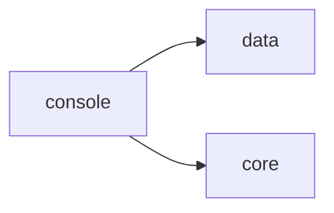

# Traffic Console

[_Documentation generated by Documatic_](https://www.documatic.com)

<!---Documatic-section-Codebase Structure-start--->
## Codebase Structure

<!---Documatic-block-system_architecture-start--->

<!---Documatic-block-system_architecture-end--->

# #
<!---Documatic-section-Codebase Structure-end--->

<!---Documatic-section-traffic.console.__init__.dispatch_open-start--->
## [traffic.console.__init__.dispatch_open](7-traffic_console.md#traffic.console.__init__.dispatch_open)

<!---Documatic-section-dispatch_open-start--->
<!---Documatic-block-traffic.console.__init__.dispatch_open-start--->
<details>
	<summary><code>traffic.console.__init__.dispatch_open</code> code snippet</summary>

```python
def dispatch_open(filename: Path) -> None:
    if sys.platform.startswith('darwin'):
        subprocess.call(('open', filename))
    elif os.name == 'nt':
        os.startfile(filename)
    elif os.name == 'posix':
        subprocess.call(('xdg-open', filename))
```
</details>
<!---Documatic-block-traffic.console.__init__.dispatch_open-end--->
<!---Documatic-section-dispatch_open-end--->

# #
<!---Documatic-section-traffic.console.__init__.dispatch_open-end--->

[_Documentation generated by Documatic_](https://www.documatic.com)